# 记忆系统数据流文档

**系统:** Qianxue-master (AI Agent仿人类记忆系统)
**文档版本:** 2.1
**最后更新:** 2026-04-12

---

## 📋 目录

1. [系统架构图](#1-系统架构图)
2. [写入流程](#2-写入流程)
3. [巩固流程](#3-巩固流程)
4. [召回流程](#4-召回流程)
5. [数据存储](#5-数据存储)
6. [性能优化](#6-性能优化)

---

## 1. 系统架构图

### 1.1 整体架构

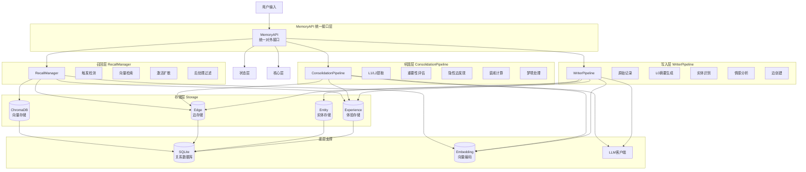

### 1.2 数据流路径

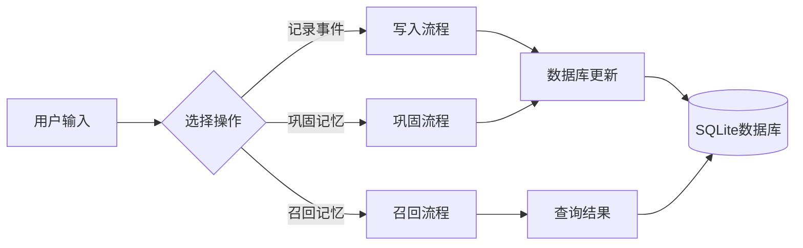

---

## 2. 写入流程

### 2.1 写入流程总览

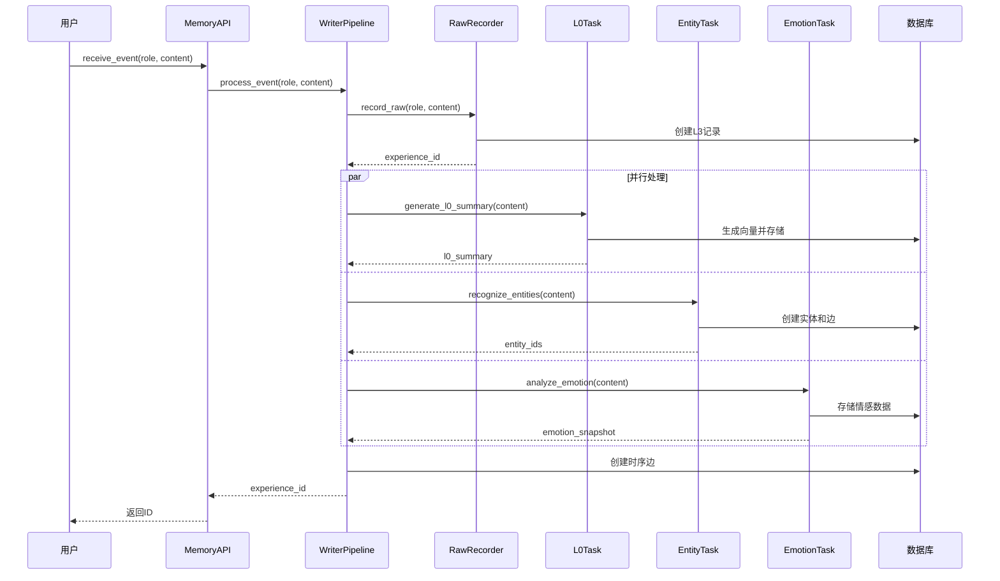

### 2.2 写入流程详细步骤

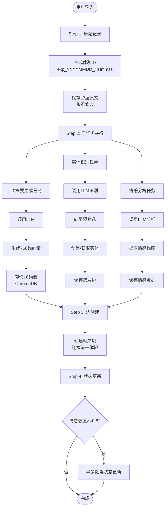

### 2.3 数据状态变化

| 阶段 | L3_raw | L0_text | L0_embedding | L1/L2 | Entities | Emotion | Edges |
|------|--------|---------|--------------|-------|----------|---------|-------|
| 输入 | ✅ | ❌ | ❌ | ❌ | ❌ | ❌ | ❌ |
| Step 1 | ✅ | ❌ | ❌ | ❌ | ❌ | ❌ | ❌ |
| Step 2 | ✅ | ✅ | ✅ | ❌ | ✅ | ✅ | ✅ (跨层) |
| Step 3 | ✅ | ✅ | ✅ | ❌ | ✅ | ✅ | ✅ (时序) |
| Step 4 | ✅ | ✅ | ✅ | ❌ | ✅ | ✅ | ✅ |

---

## 3. 巩固流程

### 3.1 巩固流程总览

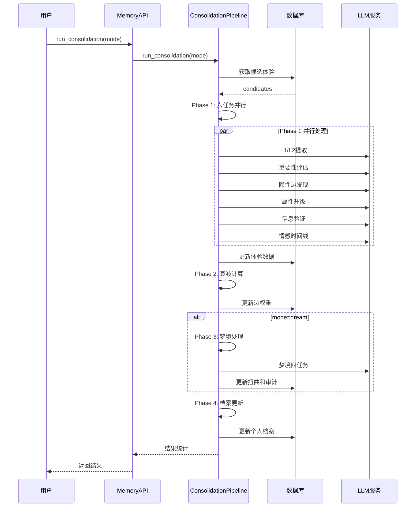

### 3.2 巩固流程详细步骤

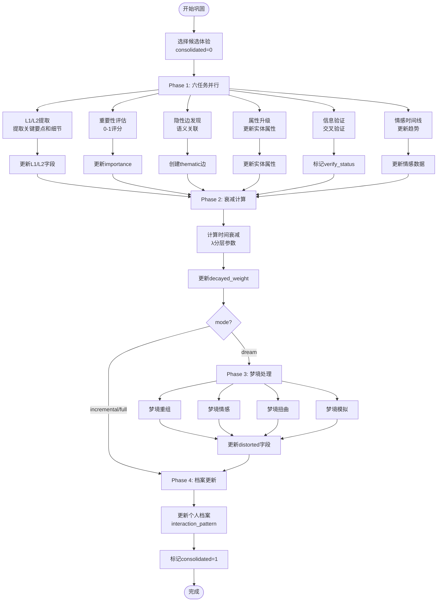

### 3.3 巩固前后数据对比

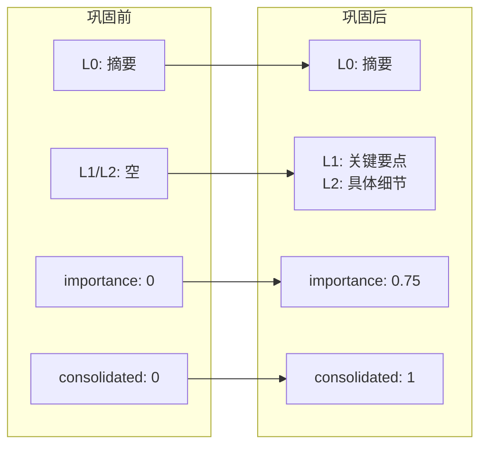

---

## 4. 召回流程

> **v2.1 更新**: 新增关键词召回路径 (`recall_by_keywords`)，供主系统直接传入关键词，跳过触发检测，返回 briefing 文本。原有 `recall()` 路径保持不变。

### 4.0 主系统与记忆系统的召回连接架构

```
主系统 (AgentBrain)
  │
  ├─ SearchMemoryTool.execute(query="张三 天气")
  │    │
  │    ▼
  │  mem_mod.memory_provider.retrieve_briefing(query="张三 天气")
  │    │
  │    ▼ HTTP POST
  │  /api/recall/keywords  {"query": "张三 天气", "context": {...}}
  │    │
  │    ▼
  │  MemoryAPI.recall_by_keywords()
  │    │ 切分为 ["张三", "天气"]
  │    ▼
  │  RecallManager.recall_by_keywords(["张三", "天气"])
  │    │ 双轨召回 + briefing 生成
  │    ▼
  │  {"briefing": "你记得张三之前说过喜欢晴天..."}
  │    │
  │    ▼ HTTP 200
  │  RecallByKeywordsResponse(briefing="...")
  │    │
  │    ▼
  │  返回 briefing 字符串给 AgentBrain
```

**关键设计决策:**
- 主系统只传关键词（不传 user_id / group_id），记忆系统全局召回
- 返回值为纯文本 briefing（自然语言内心独白），不再是结构化的 experiences/entities 列表
- 记忆系统侧**只加新方法**，不改已有方法（`recall()` / `check_recall()` / `/api/recall` 保持不变）

**踩坑记录:**
- `from module import variable` 会在导入时绑定对象引用，后续 `module.variable = new_obj` 替换不会生效。必须用 `import module; module.variable` 运行时访问。

### 4.1 召回流程总览

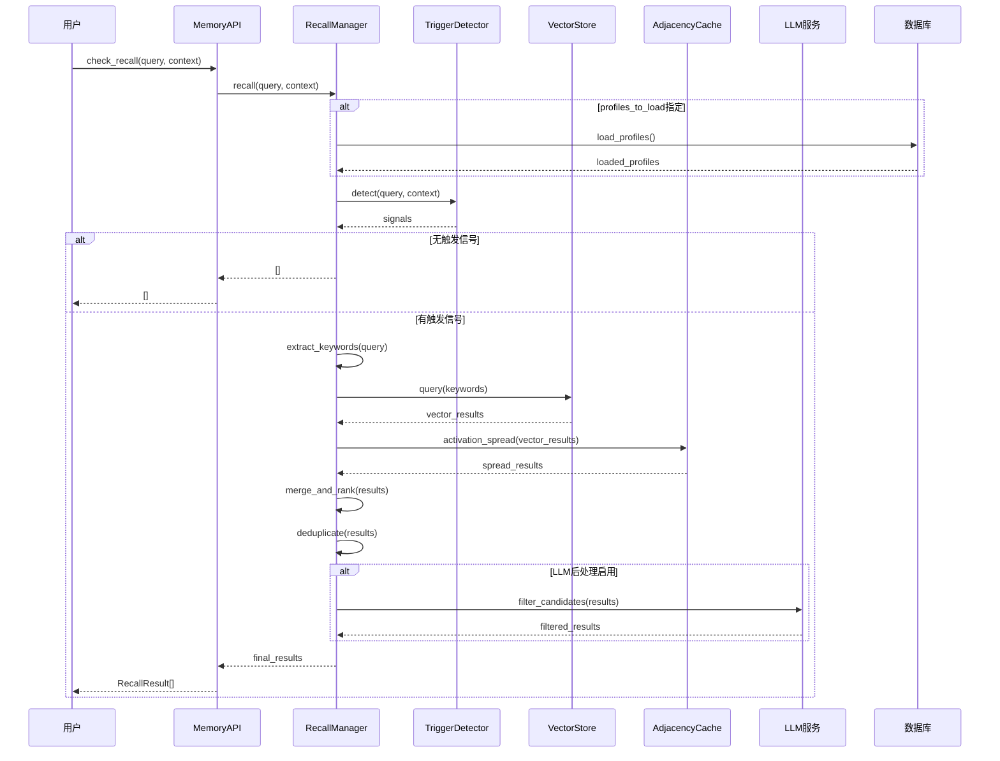

### 4.2 关键词召回流程（新增 v2.1）

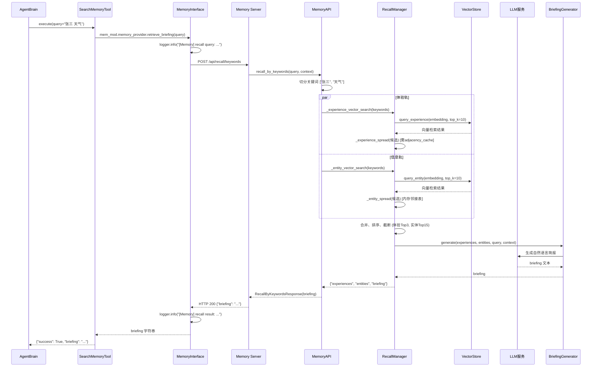

### 4.3 原有召回流程详细步骤（保持不变）

```mermaid
graph TB
    Start([用户查询]) --> Step0[Step 0: 档案加载]
    Step0 --> CheckProfile{profiles_to_load?}
    CheckProfile -->|是| LoadProfile[加载个人档案]
    CheckProfile -->|否| Step1
    LoadProfile --> Step1[Step 1: 触发检测]
    
    Step1 --> Detect[检测触发信号<br/>实体/时间/状态]
    Detect --> CheckSignal{有触发信号?}
    
    CheckSignal -->|否| NoResult[返回空列表]
    CheckSignal -->|是| Step2[Step 2: 关键词提取]
    
    Step2 --> Extract[提取查询关键词<br/>排除冗余词]
    Extract --> Step3[Step 3: 向量检索]
    
    Step3 --> Encode[编码关键词向量]
    Encode --> QueryChroma[查询ChromaDB<br/>Top-K=10]
    QueryChroma --> VectorResults[向量检索结果]
    
    VectorResults --> Step4[Step 4: 激活扩散]
    Step4 --> LoadCache[加载邻接表缓存]
    LoadCache --> Spread[激活扩散计算<br/>hop_distance决定跳数]
    Spread --> SpreadResults[扩散结果]
    
    SpreadResults --> Step5[Step 5: 排序过滤]
    Step5 --> Merge[合并候选集<br/>A ∪ B]
    Merge --> Rank[按激活分数排序<br/>importance × source_type]
    Rank --> Dedup[去重]
    
    Dedup --> Step6[Step 6: 后处理]
    Step6 --> CheckLLM{LLM后处理?}
    
    CheckLLM -->|是| LLMFilter[LLM二分类<br/>should_mention?]
    CheckLLM -->|否| Step7
    LLMFilter --> Step7[Step 7: 深度展开]
    
    Step7 --> CheckExpand{需要展开?}
    CheckExpand -->|是| Expand[展开L1/L2/L3]
    CheckExpand -->|否| FinalResult[返回最终结果]
    Expand --> FinalResult
    
    NoResult --> End([结束])
    FinalResult --> End
```

### 4.4 召回结果生成

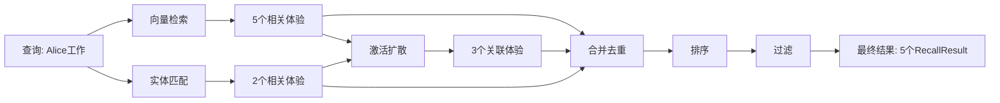

---

## 5. 数据存储

### 5.1 数据库架构

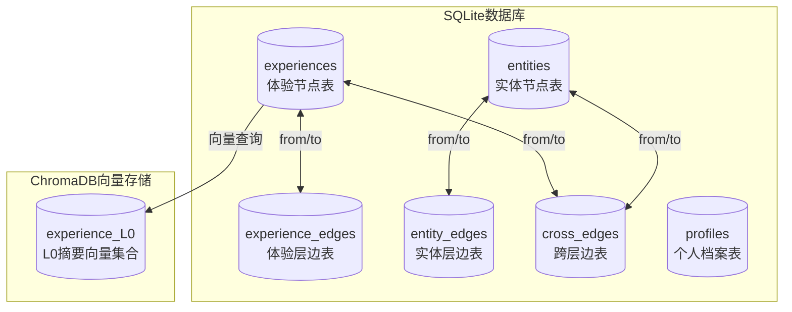

### 5.2 数据分层存储

| 层级 | 存储位置 | 访问频率 | 更新频率 |
|------|----------|----------|----------|
| L0 | SQLite + ChromaDB | 极高 | 一次创建 |
| L1 | SQLite | 高 | 巩固时更新 |
| L2 | SQLite | 中 | 巩固时更新 |
| L3 | SQLite | 低 | 永不修改 |

---

## 6. 性能优化

### 6.1 并发处理策略

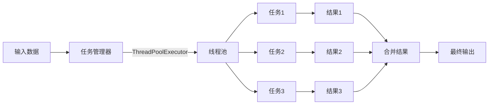

### 6.2 向量检索优化

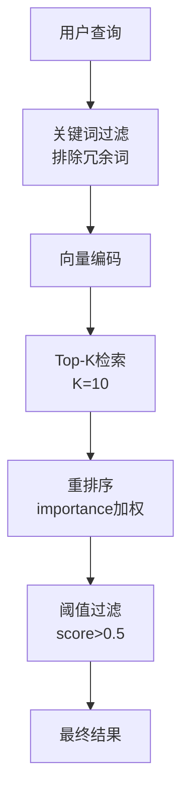

---

## 7. 总结

### 7.1 数据流关键特征

1. **分层处理**: 写入、巩固、召回各司其职
2. **并行优化**: 大量使用并发处理提高性能
3. **向量加速**: 关键步骤使用向量检索
4. **状态保持**: 多层数据结构保持不同抽象级别
5. **动态更新**: 权重衰减、激活扩散等动态机制

### 7.2 数据流转路径

**写入路径**: 用户 → MemoryAPI → WriterPipeline → 并行处理 → 数据库
**巩固路径**: 数据库 → ConsolidationPipeline → 六任务并行 → 更新数据库
**召回路径**: 用户 → MemoryAPI → RecallManager → 多阶段处理 → 返回结果

---

_最后更新: 2026-04-12_
_作者: Claude (System Analysis)_
_版本: 2.1_