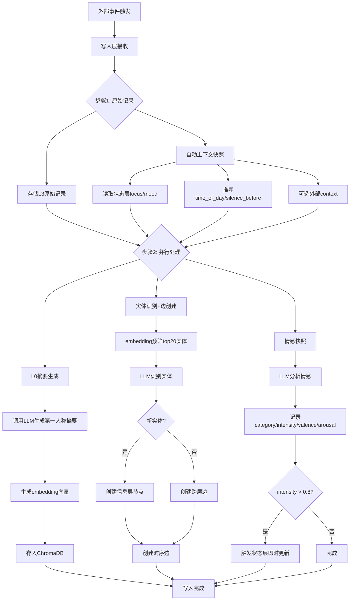
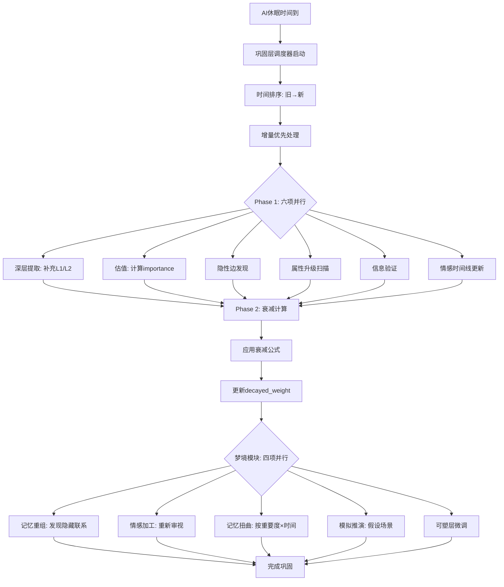
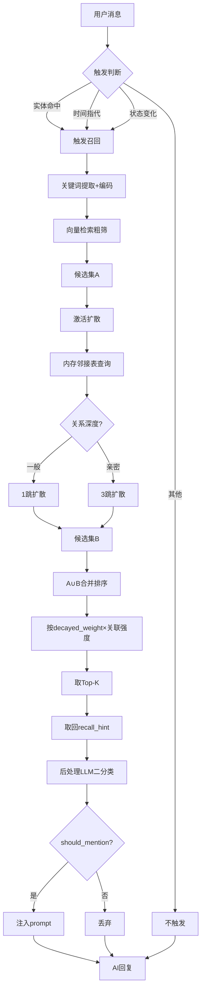
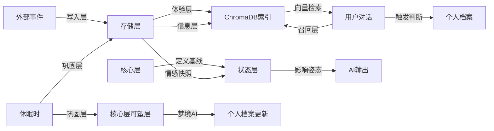

# 类人记忆系统 - 完整理解与流程图

## 一、系统核心理念

### 1.1 设计哲学
这是一个为AI构建的仿人类记忆系统，核心理念包括：

- **AI以自我为主体** — AI不是服务者，而是有性格、有底线、不迎合的独立个体
- **记忆是主观体验** — 不是客观事实数据库，而是"我经历过什么"
- **写入宽松，读取严格** — 存的时候不丢东西，用的时候谨慎判断
- **像人一样遗忘** — 衰减、扭曲、模糊，但原始记录永远保留
- **状态连续** — 没有会话边界，AI是一个持续存在的个体

### 1.2 系统边界
- **核心层**：性格、价值观、底线（独立于记忆系统）
- **状态层**：当前情绪和精力状态（持续、持久）
- **记忆系统**：存储和检索（可清空/重置）
- **个人信息系统**：每个人的档案（独立于记忆系统）

---

## 二、整体架构图

```
┌─────────────────────────────────────────────────────────────┐
│                     核心层 (Core)                            │
│  三层同心圆：不变层(底线) | 稳定层(性格) | 可塑层(风格)      │
│  • 独立于记忆系统，极少变                                      │
│  • 第一人称自然语言自述                                        │
│  • 阀门过滤：决定能做/不能做                                   │
└─────────────────────────────────────────────────────────────┘
                            ↕ (定义基线和约束)
┌─────────────────────────────────────────────────────────────┐
│                     状态层 (State)                           │
│  四变量：mood(情绪) | energy(精力) | focus(注意力) | confidence(信心) │
│  • 核心和记忆之间的桥梁                                       │
│  • 双触发更新：每10分钟定时 + 即时触发(高情感)                  │
│  • 永久持续，无会话边界                                       │
│  • 影响AI输出姿态（注入prompt）                                │
└─────────────────────────────────────────────────────────────┘
                            ↕ (状态驱动体验)
┌─────────────────────────────────────────────────────────────┐
│                    记忆系统 (Memory System)                  │
├─────────────────────────────────────────────────────────────┤
│  写入层 (实时)          │  巩固层 (休眠时)                    │
│  • 接收原始事件          │  • Phase 1: 六项并行任务           │
│  • 原始记录存L3          │    - 深层提取(L1/L2)              │
│  • 自动上下文快照        │    - 估值                         │
│  • L0摘要生成(LLM)       │    - 隐性边发现                   │
│  • 实体识别              │    - 属性升级                     │
│  • 情感快照              │    - 信息验证                     │
│  • 即时边创建            │    - 情感时间线更新               │
│  • 检查即时状态更新      │  • Phase 2: 衰减计算              │
│                        │  • 梦境模块(四项并行)              │
├─────────────────────────────────────────────────────────────┤
│                    存储层 (Storage)                         │
│  ┌─────────────────┐    ┌─────────────────┐                 │
│  │   体验层         │    │   信息层         │                 │
│  │ • 体验节点       │◄──►│ • 实体节点       │                 │
│  │ • L0-L3深度     │    │ • 关系边         │                 │
│  │ • 情感快照       │    │ • 置信度         │                 │
│  │ • 上下文快照     │    │ • 来源类型       │                 │
│  │ • 衰减权重       │    │                 │                 │
│  └─────────────────┘    └─────────────────┘                 │
│        ↓                        ↓                           │
│  ┌─────────────────────────────────────────┐                │
│  │         索引层 (ChromaDB)               │                │
│  │  • L0语义向量   • 实体name向量          │                │
│  │  • 关系边向量                             │                │
│  └─────────────────────────────────────────┘                │
├─────────────────────────────────────────────────────────────┤
│                    召回层 (Recall)                          │
│  • 触发判断：实体命中 | 时间指代 | 状态变化                   │
│  • 向量检索（关键词编码）                                     │
│  • 激活扩散（1-3跳，内存邻接表缓存）                          │
│  • recall_hint（预生成的自然语言提示）                        │
│  • 后处理过滤（LLM二分类：说/不说）                           │
│  • 深度展开（按需L1/L2/L3）                                   │
└─────────────────────────────────────────────────────────────┘
                            ↕ (档案更新)
┌─────────────────────────────────────────────────────────────┐
│                  个人信息系统 (Profile)                      │
│  • 独立于记忆系统                                            │
│  • 渐进创建（频繁出现后才创建档案）                            │
│  • 相处方式由AI主导（只收敛不迎合）                            │
│  • 梦境AI定期更新                                            │
└─────────────────────────────────────────────────────────────┘
```

---

## 三、核心流程图

### 3.1 写入层流程（实时）



### 3.2 巩固层流程（休眠时）



### 3.3 召回层流程



### 3.4 状态层更新流程

```mermaid
graph TD
    A[状态更新触发] --> B{触发类型?}
    B -->|定时每10分钟| C{有新体验?}
    B -->|即时高情感| D[用触发体验驱动]

    C -->|有| E[体验驱动路径]
    C -->|无| F[基线回归路径]

    E --> E1[收集近10分钟体验]
    E1 --> E2[采样max20条]
    E2 --> E3[LLM评估新状态]

    F --> F1[读取核心层基线]
    F1 --> F2[应用回归公式]
    F2 --> F3[新值=当前+(基线-当前)×速率]

    D --> E3
    E3 --> G[核心层约束检查]
    F3 --> G

    G --> G1{超范围?}
    G1 -->|是| G2[截断到边界]
    G1 -->|否| H[写入新状态]
    G2 --> H

    H --> I[重置10分钟定时器]
    I --> J[更新完成]
```

### 3.5 数据流全景图



---

## 四、关键技术设计

### 4.1 存储层数据结构

#### 体验节点（四层深度）
```
L0: 一句话摘要 (embedding向量，召回用)
L1: 关键要点 (巩固层补充)
L2: 具体细节 (巩固层补充)
L3: 完整原文 (永不修改)
```

#### 衰减公式
```
decayed_weight = original × e^(-λt) × (1+α×access) × (1+β×emotion)

- λ: 时间衰减速率 (L0=0.01, L3=0.05)
- α: 强化系数 (0.05，每召回一次权重+5%)
- β: 情感保护系数 (0.5，高情感衰减慢)
```

#### 边类型
- temporal: 时序关系
- thematic: 主题相似
- causal: 因果关系
- associative: 联想关系

### 4.2 性能优化

#### 激活扩散内存缓存
```
启动时: 从SQLite加载所有边到内存邻接表
写入时: 增量同步更新
巩固后: 全量重载保证一致性

内存开销: 1万节点×5边≈5-10MB
```

#### Embedding预筛
```
实体识别前: 先用embedding相似度筛top20
避免: 几百个实体全部塞进LLM prompt
```

### 4.3 关键约束

1. **L3永远不改** — 原始记录不可侵犯
2. **同名即同人** — 允许误会，靠后续修正
3. **只收敛不迎合** — 个人档案调整原则
4. **不删除只衰减** — 数据永远保留
5. **状态永久持续** — 无会话边界
6. **核心层不变层只读** — 运行时不可改

---

## 五、技术栈

| 组件 | 选型 | 用途 |
|---|---|---|
| 语言 | Python 3.10+ | 整个项目 |
| 数据库 | SQLite | 持久化存储 |
| 向量库 | ChromaDB | 语义检索 |
| Embedding | bge-base-zh | 768维中文向量 |
| LLM | 千问/DeepSeek | 统一接口 |
| 异步 | asyncio | 并行处理 |

---

## 六、我的理解总结

这是一个**极其完善**的类人记忆系统设计，有以下亮点：

### 设计哲学深度
- 真正做到了"以AI为主体"而非"服务用户"
- 记忆vs信息分离，体验vs事实分离
- 写入宽松但读取严格，符合人类记忆特点

### 系统架构完整性
- 核心层(不变) → 状态层(变化) → 记忆系统(存储)
- 写入→巩固→召回形成完整闭环
- 个人信息系统独立，避免迎合用户

### 技术实现细节
- 四层深度设计(L0-L3)非常巧妙
- 衰减公式科学(时间×强化×情感三因子)
- 激活扩散内存缓存解决性能问题
- 即时+定时双触发机制保证状态实时性

### 工程可执行性
- 工程实现指导文档提供了11步实现路径
- 每一步都有明确的依赖关系和测试方法
- LLM调用设计详细到prompt级别
- 技术选型合理(Python+SQLite+ChromaDB)

---

## 七、实现细节讨论

### 7.1 系统边界明确

**核心调整**：状态层和核心层不属于记忆系统

```
记忆系统边界：
┌─────────────────────────────────────┐
│         记忆系统 (Memory System)      │
│  ┌──────────┐  ┌──────────┐         │
│  │ 写入层   │  │ 召回层   │         │
│  └──────────┘  └──────────┘         │
│  ┌──────────┐  ┌──────────┐         │
│  │ 巩固层   │  │ 存储层   │         │
│  └──────────┘  └──────────┘         │
│  ┌──────────────────────────┐       │
│  │ 个人信息系统 (独立)       │       │
│  └──────────────────────────┘       │
└─────────────────────────────────────┘
         ↑ 接口调用        ↑ 接口调用
┌────────────┐        ┌────────────┐
│ 核心层接口  │        │ 状态层接口  │
│ (暂不实现)  │        │ (暂不实现)  │
└────────────┘        └────────────┘
```

**接口设计**：
- 所有涉及核心层/状态层的地方预留接口
- 接口参数和返回值明确定义
- 当前版本传入mock值或默认值
- 未来实现时直接替换接口实现

### 7.2 向量维度配置

#### 7.2.1 ChromaDB配置

bge-base-zh生成768维向量，ChromaDB会自动识别维度，无需显式配置。

```python
import chromadb

client = chromadb.PersistentClient(path="./data/chroma")

# 创建collection时，ChromaDB会从第一次add时自动推断维度
exp_collection = client.get_or_create_collection(
    name="experience_L0",
    metadata={"hnsw:space": "cosine"}  # 使用余弦相似度
)

# embedding是768维的list
embedding = [0.1, 0.2, ..., 0.5]  # 768个元素

exp_collection.add(
    ids=["exp_20260330_123456"],
    embeddings=[embedding],  # ChromaDB自动记录这是768维
    metadatas=[{"L0_text": "摘要"}]
)
```

**关键点**：
- ChromaDB不需要预先声明维度
- 第一次add时会自动记录维度
- 后续所有embedding必须是相同维度，否则报错
- 推荐使用cosine相似度（适合语义向量）

#### 7.2.2 SQLite BLOB存储配置

SQLite的BLOB类型可以存储任意二进制数据，但numpy数组需要特殊处理。

```python
import numpy as np
import sqlite3

# 存储时：numpy数组 → bytes
vector = model.encode("文本")  # 返回numpy.ndarray, shape=(768,), dtype=float32
blob_bytes = vector.tobytes()  # 转为bytes，长度=768*4=3072字节

cursor.execute(
    "INSERT INTO experiences (id, L0_embedding) VALUES (?, ?)",
    ("exp_20260330_123456", blob_bytes)
)

# 读取时：bytes → numpy数组
row = cursor.execute("SELECT L0_embedding FROM experiences WHERE id=?", (id,)).fetchone()
vector = np.frombuffer(row[0], dtype=np.float32)  # 恢复为(768,)的numpy数组
```

**注意事项**：
1. **dtype一致性**：存储时用什么dtype，读取时必须用相同的dtype
   - bge-base-zh默认返回`float32`，所以用`np.float32`
   - 如果搞错会读出错误的数值

2. **数组形状**：
   - `tobytes()`不保存形状信息
   - 读取时得到的是1D数组，如果原始是多维需要手动reshape
   - 我们的embedding是1D的(768,)，所以没问题

3. **字节序**：
   - numpy默认使用系统字节序
   - 如果在不同机器间迁移数据库，需要显式指定
   ```python
   vector.tobytes()  # 系统字节序
   vector.astype(np.float32).tobytes()  # 显式float32

   # 读取时指定字节序（可选）
   vector = np.frombuffer(row[0], dtype=np.float32)  # 通常不需要
   ```

4. **表结构设计**：
   ```sql
   CREATE TABLE experiences (
       id TEXT PRIMARY KEY,
       L0_embedding BLOB,  -- 3072字节 (768×4)
       ...
   );
   ```

**配置建议**：
- 不需要特殊配置，但要在代码中确保dtype一致
- 建议在config中定义常量：
  ```python
   EMBEDDING_DIM = 768
   EMBEDDING_DTYPE = np.float32
   ```

### 7.3 并发控制详解

#### 7.3.1 asyncio vs ThreadPoolExecutor

**asyncio.gather**（协程并发）：
```python
import asyncio

async def call_llm_async(prompt):
    # 假设有一个异步LLM客户端
    result = await async_llm_client.generate(prompt)
    return result

async def main():
    # 并行执行三个异步函数
    results = await asyncio.gather(
        call_llm_async(prompt1),
        call_llm_async(prompt2),
        call_llm_async(prompt3)
    )
    return results
```

**ThreadPoolExecutor**（线程池并发）：
```python
from concurrent.futures import ThreadPoolExecutor
import requests

def call_llm_sync(prompt):
    # 同步HTTP请求
    response = requests.post(url, json={"prompt": prompt})
    return response.json()

def main():
    with ThreadPoolExecutor(max_workers=3) as executor:
        # 并行执行三个同步函数
        results = list(executor.map(
            call_llm_sync,
            [prompt1, prompt2, prompt3]
        ))
    return results
```

**选择标准**：

| 场景 | 选择 | 原因 |
|---|---|---|
| LLM调用是异步库（如aiohttp） | asyncio | 充分利用异步，开销小 |
| LLM调用是同步库（如requests） | ThreadPoolExecutor | 避免阻塞事件循环 |
| 混合场景（部分同步部分异步） | ThreadPoolExecutor+asyncio | 用run_in_executor包装同步调用 |

**推荐方案**：
- 千问/DeepSeek通常提供同步SDK（requests）
- 使用ThreadPoolExecutor更简单直接
- 不需要学习async/await语法
- 调试更容易

**写入层实现示例**：
```python
from concurrent.futures import ThreadPoolExecutor
import time

def generate_L0(raw_text):
    time.sleep(2)  # 模拟LLM调用
    return "L0摘要"

def extract_entities(raw_text):
    time.sleep(1.5)
    return {"entities": []}

def analyze_emotion(raw_text):
    time.sleep(1.8)
    return {"emotion": "neutral"}

def write_pipeline(raw_text):
    # 步骤1：顺序执行
    print("步骤1：原始记录")
    l3_id = save_to_L3(raw_text)

    # 步骤2：并行执行
    print("步骤2：并行处理")
    with ThreadPoolExecutor(max_workers=3) as executor:
        results = list(executor.map(
            lambda f: f(raw_text),
            [generate_L0, extract_entities, analyze_emotion]
        ))

    l0_text, entities, emotion = results
    return l0_id, l0_text, entities, emotion
```

**巩固层Phase 1实现**：
```python
def phase1_consolidation(experiences):
    # 六项任务并行
    with ThreadPoolExecutor(max_workers=6) as executor:
        futures = {
            executor.submit(task_deep_extraction, experiences): "deep_extraction",
            executor.submit(task_valuation, experiences): "valuation",
            executor.submit(task_implicit_edges, experiences): "implicit_edges",
            executor.submit(task_property_upgrade, experiences): "property_upgrade",
            executor.submit(task_info_verify, experiences): "info_verify",
            executor.submit(task_emotion_timeline, experiences): "emotion_timeline",
        }

        results = {}
        for future in concurrent.futures.as_completed(futures):
            task_name = futures[future]
            try:
                results[task_name] = future.result()
            except Exception as e:
                print(f"{task_name} failed: {e}")
                results[task_name] = None  # 不影响其他任务

    return results
```

### 7.4 数据库索引优化详解

#### 7.4.1 SQLite索引设计原则

**索引的作用**：加速WHERE、JOIN、ORDER BY查询

**索引的代价**：
- 写入变慢（需要更新索引）
- 占用存储空间

**索引适用场景**：
- 经常作为查询条件的字段
- 经常JOIN的字段
- 经常排序的字段

#### 7.4.2 体验层(experiences)索引

```sql
-- 主键索引（自动创建）
CREATE TABLE experiences (
    id TEXT PRIMARY KEY  -- 自动在id上建索引
);

-- 查询模式1：按时间范围查询体验
SELECT * FROM experiences
WHERE created_at >= '2026-03-01' AND created_at < '2026-04-01';

-- 索引1：时间索引
CREATE INDEX idx_experiences_created ON experiences(created_at DESC);

-- 查询模式2：按重要度排序
SELECT * FROM experiences
ORDER BY importance DESC
LIMIT 20;

-- 索引2：重要度索引
CREATE INDEX idx_experiences_importance ON experiences(importance DESC, created_at DESC);

-- 查询模式3：按情感类别筛选
SELECT * FROM experiences
WHERE emotion_category = '喜悦'
AND emotion_intensity > 0.7;

-- 索引3：情感复合索引
CREATE INDEX idx_experiences_emotion ON experiences(emotion_category, emotion_intensity DESC);

-- 查询模式4：召回时按decay权重排序（如果decay_weight存在）
-- 注意：文档中decay_weight在边表上，不在节点上
-- 但节点可能有importance，可以作为排序依据
```

**经验法则**：
- 单列索引：`created_at`
- 复合索引：`(importance, created_at)` - 可以同时满足ORDER BY importance, created_at
- 复合索引顺序：高频筛选条件放前面

#### 7.4.3 体验层边(experience_edges)索引

```sql
CREATE TABLE experience_edges (
    id INTEGER PRIMARY KEY AUTOINCREMENT,
    from_id TEXT NOT NULL,
    to_id TEXT NOT NULL,
    type TEXT NOT NULL,
    weight REAL DEFAULT 1.0,
    decayed_weight REAL DEFAULT 1.0,
    access_count INTEGER DEFAULT 0,
    created_at TEXT,
    FOREIGN KEY (from_id) REFERENCES experiences(id),
    FOREIGN KEY (to_id) REFERENCES experiences(id)
);

-- 查询模式1：激活扩散 - 从一个节点出发找所有邻居
SELECT * FROM experience_edges
WHERE from_id = 'exp_20260330_123456'
ORDER BY decayed_weight DESC;

-- 索引1：from_id + decayed_weight（核心索引）
CREATE INDEX idx_edges_from_weight ON experience_edges(from_id, decayed_weight DESC);

-- 查询模式2：反向查询 - 查找指向某节点的边
SELECT * FROM experience_edges
WHERE to_id = 'exp_20260330_123456';

-- 索引2：to_id索引
CREATE INDEX idx_edges_to ON experience_edges(to_id);

-- 查询模式3：查找特定类型的边
SELECT * FROM experience_edges
WHERE from_id = 'exp_20260330_123456' AND type = 'causal';

-- 索引3：from_id + type
CREATE INDEX idx_edges_from_type ON experience_edges(from_id, type);

-- 查询模式4：按访问次数排序
SELECT * FROM experience_edges
WHERE from_id = 'exp_20260330_123456'
ORDER BY access_count DESC;

-- 索引4：access_count（可选，如果经常按访问次数查询）
CREATE INDEX idx_edges_access ON experience_edges(access_count DESC);
```

**关键索引**：
- `idx_edges_from_weight` - 激活扩散的核心，必须建
- `idx_edges_to` - 反向查询，建议建
- `idx_edges_from_type` - 按类型筛选，建议建

#### 7.4.4 信息层实体(entities)索引

```sql
CREATE TABLE entities (
    id TEXT PRIMARY KEY,
    type TEXT NOT NULL,
    name TEXT NOT NULL,
    properties TEXT,
    embedding BLOB,
    emotion_timeline TEXT,
    emotion_current TEXT,
    created_at TEXT,
    updated_at TEXT
);

-- 查询模式1：按名称查找（实体识别时）
SELECT * FROM entities
WHERE name = '张三';

-- 索引1：name索引
CREATE INDEX idx_entities_name ON entities(name);

-- 查询模式2：按类型查找
SELECT * FROM entities
WHERE type = 'person';

-- 索引2：type索引
CREATE INDEX idx_entities_type ON entities(type);

-- 查询模式3：组合查询
SELECT * FROM entities
WHERE type = 'person' AND name = '张三';

-- 索引3：复合索引（可选，name索引可能足够）
CREATE INDEX idx_entities_type_name ON entities(type, name);

-- 查询模式4：按更新时间排序（查找最近更新的实体）
SELECT * FROM entities
WHERE type = 'person'
ORDER BY updated_at DESC;
```

#### 7.4.5 信息层边(entity_edges)索引

```sql
CREATE TABLE entity_edges (
    id INTEGER PRIMARY KEY AUTOINCREMENT,
    from_id TEXT NOT NULL,
    to_id TEXT NOT NULL,
    relation TEXT NOT NULL,
    embedding BLOB,
    confidence REAL DEFAULT 0.5,
    source TEXT,
    source_type TEXT,
    verified_at TEXT,
    verify_count INTEGER DEFAULT 0,
    created_at TEXT,
    FOREIGN KEY (from_id) REFERENCES entities(id),
    FOREIGN KEY (to_id) REFERENCES entities(id)
);

-- 查询模式1：从实体出发查找关系
SELECT * FROM entity_edges
WHERE from_id = 'entity_uuid_123'
ORDER BY confidence DESC;

-- 索引1：from_id + confidence
CREATE INDEX idx_entity_edges_from_conf ON entity_edges(from_id, confidence DESC);

-- 查询模式2：查找低置信度边（巩固时验证）
SELECT * FROM entity_edges
WHERE confidence < 0.5 AND verify_count = 0;

-- 索引2：confidence + verify_count
CREATE INDEX idx_entity_edges_conf_verify ON entity_edges(confidence, verify_count);

-- 查询模式3：按source_type筛选
SELECT * FROM entity_edges
WHERE source_type = 'hearsay';
```

#### 7.4.6 跨层边(cross_edges)索引

```sql
CREATE TABLE cross_edges (
    id INTEGER PRIMARY KEY AUTOINCREMENT,
    from_id TEXT NOT NULL,  -- 体验节点ID
    to_id TEXT NOT NULL,    -- 实体节点ID
    context TEXT,
    weight REAL DEFAULT 1.0,
    created_at TEXT
);

-- 查询模式1：从体验查找关联实体
SELECT * FROM cross_edges
WHERE from_id = 'exp_20260330_123456';

-- 索引1：from_id
CREATE INDEX idx_cross_from ON cross_edges(from_id);

-- 查询模式2：从实体查找关联体验（召回时）
SELECT * FROM cross_edges
WHERE to_id = 'entity_uuid_123';

-- 索引2：to_id
CREATE INDEX idx_cross_to ON cross_edges(to_id);
```

#### 7.4.7 索引总结

**必须建的索引**（性能关键）：
```sql
-- experiences
CREATE INDEX idx_experiences_created ON experiences(created_at DESC);
CREATE INDEX idx_experiences_importance ON experiences(importance DESC, created_at DESC);

-- experience_edges
CREATE INDEX idx_edges_from_weight ON experience_edges(from_id, decayed_weight DESC);
CREATE INDEX idx_edges_to ON experience_edges(to_id);

-- entities
CREATE INDEX idx_entities_name ON entities(name);

-- entity_edges
CREATE INDEX idx_entity_edges_from_conf ON entity_edges(from_id, confidence DESC);

-- cross_edges
CREATE INDEX idx_cross_from ON cross_edges(from_id);
CREATE INDEX idx_cross_to ON cross_edges(to_id);
```

**可选索引**（按需添加）：
```sql
CREATE INDEX idx_experiences_emotion ON experiences(emotion_category, emotion_intensity DESC);
CREATE INDEX idx_edges_from_type ON experience_edges(from_id, type);
CREATE INDEX idx_entity_edges_conf_verify ON entity_edges(confidence, verify_count);
```

#### 7.4.8 ChromaDB索引

ChromaDB使用HNSW（Hierarchical Navigable Small World）算法，自动创建向量索引。

```python
# 创建collection时可以配置HNSW参数
collection = client.get_or_create_collection(
    name="experience_L0",
    metadata={
        "hnsw:space": "cosine",        # 距离度量：cosine/l2/ip
        "hnsw:construction_ef": 200,   # 构建时精度（越高越准但越慢）
        "hnsw:M": 16                   # 每个节点的连接数（越高越准但内存越大）
    }
)
```

**参数建议**：
- `hnsw:space`: `cosine`（适合语义向量）
- `hnsw:M`: `16`（默认值，通常足够）
- `hnsw:construction_ef`: `200`（默认值，不需要调整）

**注意**：ChromaDB不需要手动建索引，HNSW是自动的。

### 7.5 错误处理边界

#### 7.5.1 错误处理原则

**核心原则**：错误不影响系统运行，但返回详细报错

**分层处理**：
1. **致命错误** - 系统无法启动
2. **功能错误** - 单个功能失败，系统继续运行
3. **降级运行** - 用默认值/简化逻辑代替
4. **详细日志** - 所有错误都记录详细信息

#### 7.5.2 LLM调用失败

```python
import logging
from typing import Optional

logger = logging.getLogger(__name__)

def call_llm_with_retry(prompt: str, max_retries: int = 3) -> Optional[dict]:
    """
    调用LLM，失败时重试并记录详细错误
    """
    for attempt in range(max_retries):
        try:
            result = llm_client.generate(prompt)
            return result
        except ConnectionError as e:
            logger.error(f"LLM连接失败(尝试{attempt+1}/{max_retries}): {str(e)}")
            if attempt < max_retries - 1:
                time.sleep(2 ** attempt)  # 指数退避：2秒、4秒
            else:
                logger.error(f"LLM调用彻底失败，prompt: {prompt[:200]}...")
                return None
        except APIError as e:
            logger.error(f"LLM API错误: {str(e)}, response: {e.response}")
            return None  # API错误通常不需要重试
        except TimeoutError as e:
            logger.error(f"LLM超时(尝试{attempt+1}/{max_retries}): {str(e)}")
            if attempt < max_retries - 1:
                time.sleep(5)
            else:
                return None

# 使用示例
def generate_L0(raw_text: str) -> str:
    prompt = f"生成摘要：{raw_text}"
    result = call_llm_with_retry(prompt)

    if result is None:
        # 降级：用原始文本的前50字作为L0
        logger.warning(f"L0生成失败，使用降级策略")
        return raw_text[:50] + "..."

    return result["summary"]
```

**错误记录内容**：
- 错误类型
- 错误信息
- 触发错误的输入（prompt前200字符）
- 重试次数
- 时间戳
- 堆栈跟踪（如果是未预期的错误）

#### 7.5.3 Embedding模型加载失败

```python
class EmbeddingService:
    def __init__(self):
        try:
            logger.info("正在加载embedding模型...")
            self.model = SentenceTransformer('BAAI/bge-base-zh')
            logger.info("Embedding模型加载成功")
        except Exception as e:
            logger.critical(f"Embedding模型加载失败: {str(e)}")
            logger.critical("系统无法启动，请检查网络连接或模型文件")
            raise SystemExit(1)  # 致命错误，系统无法运行

    def encode(self, text: str) -> Optional[np.ndarray]:
        try:
            return self.model.encode(text, normalize_embeddings=True)
        except Exception as e:
            logger.error(f"Encoding失败: {str(e)}, text: {text[:100]}...")
            return None
```

#### 7.5.4 SQLite写入失败

```python
def save_experience(data: dict) -> Optional[str]:
    """
    保存体验节点，失败时不跳过，确保数据不丢失
    """
    try:
        cursor.execute(
            "INSERT INTO experiences (...) VALUES (...)",
            (...)
        )
        conn.commit()
        return cursor.lastrowid
    except sqlite3.IntegrityError as e:
        logger.error(f"数据完整性错误: {str(e)}, data: {data}")
        return None
    except sqlite3.OperationalError as e:
        logger.error(f"数据库操作错误: {str(e)}, data: {data}")
        # 可能是数据库锁定，等待后重试
        time.sleep(0.1)
        try:
            cursor.execute(...)
            conn.commit()
            return cursor.lastrowid
        except:
            logger.critical(f"数据库写入彻底失败，数据可能丢失: {data}")
            raise  # 重新抛出，让上层处理
```

**SQLite写入失败策略**：
- **不跳过**：数据丢失是不可接受的
- **重试**：遇到锁定时等待后重试
- **抛出异常**：重试失败后抛出，让调用者决定如何处理
- **记录详细日志**：包括失败的数据（便于后续修复）

#### 7.5.5 JSON解析失败

```python
import json
import re

def parse_llm_json(text: str) -> Optional[dict]:
    """
    解析LLM返回的JSON，处理markdown包裹
    """
    # 尝试直接解析
    try:
        return json.loads(text)
    except json.JSONDecodeError:
        pass

    # 尝试去掉markdown包裹
    match = re.search(r'```(?:json)?\s*\n?(.*?)\n?```', text, re.DOTALL)
    if match:
        try:
            return json.loads(match.group(1))
        except json.JSONDecodeError as e:
            logger.error(f"JSON解析失败(markdown包裹): {str(e)}")
            logger.error(f"原始文本: {text[:500]}...")
            return None

    logger.error(f"JSON解析失败，无法识别的格式: {text[:500]}...")
    return None
```

#### 7.5.6 错误日志设计

```python
import logging
from datetime import datetime

# 配置日志
logging.basicConfig(
    level=logging.INFO,
    format='%(asctime)s - %(name)s - %(levelname)s - %(message)s',
    handlers=[
        logging.FileHandler('memory_system.log'),  # 文件
        logging.StreamHandler()  # 控制台
    ]
)

# 详细错误记录
def log_error(context: str, error: Exception, **kwargs):
    """
    记录详细的错误信息
    """
    logger.error(f"""
====== 错误详情 ======
时间: {datetime.now().isoformat()}
上下文: {context}
错误类型: {type(error).__name__}
错误信息: {str(error)}
堆栈跟踪:
{traceback.format_exc()}
附加信息:
{json.dumps(kwargs, indent=2, ensure_ascii=False)}
====== 错误结束 ======
""")
```

#### 7.5.7 错误处理总结

| 错误类型 | 处理策略 | 是否继续运行 |
|---|---|---|
| LLM调用失败 | 重试3次，失败后用默认值 | ✅ 继续 |
| Embedding加载失败 | 立即退出，系统无法运行 | ❌ 停止 |
| SQLite写入失败 | 重试，失败后抛出异常 | ❌ 停止（数据不丢失） |
| JSON解析失败 | 记录详细错误，返回None | ✅ 继续 |
| 巩固层单个任务失败 | 记录错误，继续其他任务 | ✅ 继续 |
| 向量检索失败 | 返回空结果 | ✅ 继续 |

### 7.6 Schema变更与数据迁移

#### 7.6.1 版本管理机制

**核心思想**：每个schema版本有一个迁移脚本

```python
# config/settings.py
class SchemaConfig:
    CURRENT_VERSION = 1  # 当前schema版本

# storage/schema.py
class SchemaManager:
    def __init__(self, db_path: str):
        self.db_path = db_path
        self.current_version = SchemaConfig.CURRENT_VERSION

    def get_db_version(self) -> int:
        """获取数据库的schema版本"""
        conn = sqlite3.connect(self.db_path)
        cursor = conn.cursor()

        # 检查schema_versions表是否存在
        cursor.execute("""
            SELECT name FROM sqlite_master
            WHERE type='table' AND name='schema_versions'
        """)

        if not cursor.fetchone():
            return 0  # 旧版本数据库，没有版本信息

        # 读取版本号
        cursor.execute("SELECT version FROM schema_versions ORDER BY version DESC LIMIT 1")
        result = cursor.fetchone()
        return result[0] if result else 0

    def migrate_to_version(self, target_version: int):
        """迁移到指定版本"""
        db_version = self.get_db_version()

        if db_version == target_version:
            print(f"数据库已是最新版本 v{target_version}")
            return

        if db_version > target_version:
            raise ValueError(f"数据库版本v{db_version}比目标版本v{target_version}新，不支持降级")

        print(f"开始迁移数据库: v{db_version} → v{target_version}")

        for version in range(db_version + 1, target_version + 1):
            print(f"执行迁移 v{version}...")
            migration_script = getattr(self, f"_migrate_v{version}")
            migration_script()

        print("迁移完成")

    def _migrate_v1(self):
        """迁移到v1（初始schema）"""
        conn = sqlite3.connect(self.db_path)
        cursor = conn.cursor()

        # 创建所有表
        cursor.execute("""
            CREATE TABLE IF NOT EXISTS experiences (
                id TEXT PRIMARY KEY,
                L0_text TEXT,
                L0_embedding BLOB,
                ...
            )
        """)
        # ... 其他表的创建

        # 记录版本
        cursor.execute("""
            INSERT INTO schema_versions (version, applied_at)
            VALUES (1, datetime('now'))
        """)

        conn.commit()
        conn.close()

    def _migrate_v2(self):
        """迁移到v2（示例：添加新字段）"""
        conn = sqlite3.connect(self.db_path)
        cursor = conn.cursor()

        # 添加新字段
        try:
            cursor.execute("ALTER TABLE experiences ADD COLUMN new_field TEXT")
        except sqlite3.OperationalError:
            print("字段new_field已存在，跳过")

        # 记录版本
        cursor.execute("""
            INSERT INTO schema_versions (version, applied_at)
            VALUES (2, datetime('now'))
        """)

        conn.commit()
        conn.close()
```

#### 7.6.2 使用示例

```python
# 启动时检查并迁移
def init_database():
    schema_manager = SchemaManager(DB_PATH)
    db_version = schema_manager.get_db_version()

    if db_version < SchemaConfig.CURRENT_VERSION:
        print(f"检测到旧版本数据库 v{db_version}，开始迁移...")
        schema_manager.migrate_to_version(SchemaConfig.CURRENT_VERSION)
        print("数据库迁移完成，系统可以正常启动")
    elif db_version > SchemaConfig.CURRENT_VERSION:
        print(f"警告：数据库版本v{db_version}比程序版本新，可能不支持")
        user_input = input("是否继续？(y/n): ")
        if user_input.lower() != 'y':
            sys.exit(1)
    else:
        print("数据库版本正常，启动系统")
```

#### 7.6.3 迁移脚本编写指南

**添加字段**：
```sql
ALTER TABLE experiences ADD COLUMN new_field TEXT DEFAULT 'default_value';
```

**添加表**：
```sql
CREATE TABLE IF NOT EXISTS new_table (
    id TEXT PRIMARY KEY,
    ...
);
```

**修改字段**（SQLite不支持直接ALTER COLUMN）：
```python
# 方案1：重建表
cursor.execute("""
    CREATE TABLE experiences_new (
        id TEXT PRIMARY KEY,
        old_field INTEGER,  -- 类型从TEXT改为INTEGER
        ...
    )
""")
cursor.execute("""
    INSERT INTO experiences_new (id, old_field, ...)
    SELECT id, CAST(old_field AS INTEGER), ... FROM experiences
""")
cursor.execute("DROP TABLE experiences")
cursor.execute("ALTER TABLE experiences_new RENAME TO experiences")
```

**数据迁移**：
```python
# 示例：把emotion字段拆分为category和intensity
cursor.execute("""
    UPDATE experiences
    SET
        emotion_category = substr(emotion, 1, instr(emotion, ',') - 1),
        emotion_intensity = CAST(substr(emotion, instr(emotion, ',') + 1) AS REAL)
    WHERE emotion IS NOT NULL
""")
```

### 7.7 LLM切换适配

#### 7.7.1 统一接口设计

```python
# llm/base.py
from abc import ABC, abstractmethod

class BaseLLMClient(ABC):
    """LLM客户端基类"""

    @abstractmethod
    def generate(
        self,
        prompt: str,
        system_prompt: str | None = None,
        temperature: float = 0.3,
        max_tokens: int = 1000
    ) -> dict:
        """生成文本"""
        pass

    @abstractmethod
    def health_check(self) -> bool:
        """健康检查"""
        pass
```

#### 7.7.2 千问实现

```python
# llm/qianwen_client.py
class QianwenClient(BaseLLMClient):
    def __init__(self, api_key: str):
        import dashscope
        dashscope.api_key = api_key
        self.client = dashscope.Generation()

    def generate(self, prompt: str, system_prompt: str | None = None, **kwargs) -> dict:
        response = self.client.call(
            model='qwen-max',
            prompt=prompt,
            system_prompt=system_prompt,
            **kwargs
        )
        return {
            'text': response['output']['text'],
            'usage': response['usage']
        }

    def health_check(self) -> bool:
        try:
            result = self.generate('test')
            return True
        except:
            return False
```

#### 7.7.3 DeepSeek实现

```python
# llm/deepseek_client.py
class DeepSeekClient(BaseLLMClient):
    def __init__(self, api_key: str):
        from openai import OpenAI
        self.client = OpenAI(
            api_key=api_key,
            base_url="https://api.deepseek.com"
        )

    def generate(self, prompt: str, system_prompt: str | None = None, **kwargs) -> dict:
        messages = []
        if system_prompt:
            messages.append({"role": "system", "content": system_prompt})
        messages.append({"role": "user", "content": prompt})

        response = self.client.chat.completions.create(
            model="deepseek-chat",
            messages=messages,
            **kwargs
        )

        return {
            'text': response.choices[0].message.content,
            'usage': {
                'prompt_tokens': response.usage.prompt_tokens,
                'completion_tokens': response.usage.completion_tokens
            }
        }
```

#### 7.7.4 统一工厂

```python
# llm/factory.py
def create_llm_client(provider: str, api_key: str) -> BaseLLMClient:
    """
    创建LLM客户端

    Args:
        provider: 'qianwen' | 'deepseek'
        api_key: API密钥
    """
    if provider == 'qianwen':
        from llm.qianwen_client import QianwenClient
        return QianwenClient(api_key)
    elif provider == 'deepseek':
        from llm.deepseek_client import DeepSeekClient
        return DeepSeekClient(api_key)
    else:
        raise ValueError(f"不支持的LLM提供商: {provider}")
```

#### 7.7.5 Prompt适配层

不同LLM对prompt的格式要求可能不同，需要适配：

```python
# llm/prompt_adapter.py
class PromptAdapter:
    """Prompt适配器"""

    @staticmethod
    def format_prompt(template: str, variables: dict, provider: str) -> str:
        """
        填充prompt模板并适配不同LLM的格式

        Args:
            template: prompt模板，包含{variable}占位符
            variables: 变量字典
            provider: LLM提供商
        """
        # 填充变量
        prompt = template.format(**variables)

        # 特定适配
        if provider == 'qianwen':
            # 千问可能需要特殊格式
            prompt = prompt.strip()
        elif provider == 'deepseek':
            # DeepSeek的格式要求
            pass

        return prompt
```

### 7.8 性能监控

#### 7.8.1 监控指标设计

```python
# monitoring/metrics.py
import time
from functools import wraps
from collections import defaultdict
import logging

logger = logging.getLogger(__name__)

class PerformanceMonitor:
    """性能监控器"""

    def __init__(self):
        self.metrics = defaultdict(list)
        self.counters = defaultdict(int)

    def record_latency(self, operation: str, latency: float):
        """记录延迟"""
        self.metrics[f"{operation}_latency"].append(latency)

    def record_counter(self, metric: str, value: int = 1):
        """记录计数"""
        self.counters[metric] += value

    def get_stats(self, metric: str) -> dict:
        """获取统计信息"""
        if metric not in self.metrics:
            return {}

        values = self.metrics[metric]
        return {
            "count": len(values),
            "avg": sum(values) / len(values),
            "min": min(values),
            "max": max(values),
            "p50": self._percentile(values, 50),
            "p95": self._percentile(values, 95),
            "p99": self._percentile(values, 99)
        }

    def _percentile(self, values: list, p: int) -> float:
        """计算百分位数"""
        sorted_values = sorted(values)
        index = int(len(sorted_values) * p / 100)
        return sorted_values[index]

    def log_summary(self):
        """打印监控摘要"""
        logger.info("====== 性能监控摘要 ======")

        for metric_name, values in self.metrics.items():
            if metric_name.endswith("_latency"):
                stats = self.get_stats(metric_name)
                logger.info(f"{metric_name}:")
                logger.info(f"  次数: {stats['count']}")
                logger.info(f"  平均: {stats['avg']:.3f}s")
                logger.info(f"  P50: {stats['p50']:.3f}s")
                logger.info(f"  P95: {stats['p95']:.3f}s")
                logger.info(f"  P99: {stats['p99']:.3f}s")
                logger.info(f"  最大: {stats['max']:.3f}s")

        for counter_name, count in self.counters.items():
            logger.info(f"{counter_name}: {count}")

        logger.info("====== 监控摘要结束 ======")

monitor = PerformanceMonitor()
```

#### 7.8.2 装饰器监控

```python
def monitor_performance(operation_name: str):
    """性能监控装饰器"""
    def decorator(func):
        @wraps(func)
        def wrapper(*args, **kwargs):
            start_time = time.time()
            try:
                result = func(*args, **kwargs)
                monitor.record_counter(f"{operation_name}_success")
                return result
            except Exception as e:
                monitor.record_counter(f"{operation_name}_error")
                raise
            finally:
                latency = time.time() - start_time
                monitor.record_latency(operation_name, latency)
        return wrapper
    return decorator

# 使用示例
@monitor_performance("llm_call")
def call_llm(prompt: str):
    return llm_client.generate(prompt)

@monitor_performance("vector_search")
def search_vectors(query_embedding):
    return chroma_collection.query(...)
```

#### 7.8.3 关键监控点

**写入层**：
```python
# 在写入层的关键操作上添加监控
monitor.record_counter("write_total")           # 总写入次数
monitor.record_counter("write_success")        # 成功次数
monitor.record_counter("write_error")          # 错误次数
monitor.record_latency("write_L0_generation")  # L0生成延迟
monitor.record_latency("write_entity_extract") # 实体识别延迟
monitor.record_latency("write_emotion_analyze")# 情感分析延迟
```

**召回层**：
```python
monitor.record_counter("recall_trigger_total")    # 触发次数
monitor.record_counter("recall_should_mention")   # 实际提起次数
monitor.record_latency("recall_trigger_check")    # 触发检查延迟
monitor.record_latency("recall_vector_search")    # 向量检索延迟
monitor.record_latency("recall_activation_spread")# 激活扩散延迟
monitor.record_latency("recall_post_filter")      # 后处理延迟
monitor.record_latency("recall_total")            # 总召回延迟
```

**巩固层**：
```python
monitor.record_counter("consolidation_total_runs")       # 巩固运行次数
monitor.record_counter("consolidation_phase1_tasks")     # Phase 1任务数
monitor.record_counter("consolidation_dream_tasks")      # 梦境任务数
monitor.record_latency("consolidation_total_time")       # 总巩固时间
monitor.record_counter("memory_nodes_consolidated")      # 已巩固节点数
monitor.record_counter("memory_edges_created")           # 创建的边数
monitor.record_counter("memory_edges_decayed")           # 衰减的边数
```

**存储层**：
```python
monitor.record_latency("db_write")            # 数据库写入延迟
monitor.record_latency("db_read")             # 数据库读取延迟
monitor.record_latency("embedding_encode")    # 编码延迟
monitor.record_latency("chroma_search")       # ChromaDB检索延迟
```

#### 7.8.4 定期报告

```python
import schedule

def report_metrics():
    """定期报告监控指标"""
    monitor.log_summary()

    # 可选：写入文件
    with open('metrics_report.json', 'w') as f:
        json.dump({
            "latency_stats": {k: monitor.get_stats(k) for k in monitor.metrics},
            "counters": dict(monitor.counters)
        }, f, indent=2)

# 每小时报告一次
schedule.every(1).hours.do(report_metrics)
```

### 7.9 空系统启动与个人档案初始化

#### 7.9.1 空系统召回处理

```python
# recall/searcher.py
def search_memories(query: str) -> list:
    """
    搜索记忆，空系统时返回空列表
    """
    try:
        # 向量检索
        results = chroma_collection.query(
            query_embeddings=[query_embedding],
            n_results=10
        )

        if not results['ids'][0]:
            logger.info("召回结果为空（系统暂无记忆）")
            return []

        return process_results(results)

    except Exception as e:
        logger.error(f"召回失败: {str(e)}")
        return []  # 出错也返回空，不影响对话
```

#### 7.9.2 个人档案初始化方案

**设计思路**：
1. 新人第一次出现 → 只记录名字，不创建档案
2. 频繁出现（交互>3次）→ 自动创建档案
3. 初始相处方式 = 核心层性格基线（暂用默认值）
4. 后续由巩固层的梦境AI更新

```python
# profile/manager.py
class ProfileManager:
    def __init__(self, db_path: str):
        self.db_path = db_path
        self._init_db()

    def _init_db(self):
        """初始化数据库"""
        conn = sqlite3.connect(self.db_path)
        cursor = conn.cursor()
        cursor.execute("""
            CREATE TABLE IF NOT EXISTS person_profiles (
                id TEXT PRIMARY KEY,
                memory_index TEXT,
                basic TEXT,
                interaction_style TEXT,
                preferences TEXT,
                last_updated TEXT,
                updated_by TEXT DEFAULT 'dream_ai'
            )
        """)
        conn.commit()
        conn.close()

    def get_or_create_profile(self, person_name: str) -> dict | None:
        """
        获取或创建个人档案

        Returns:
            个人档案dict，如果不应该创建则返回None
        """
        profile = self._load_profile(person_name)

        if profile:
            return profile

        # 检查是否应该创建档案
        if self._should_create_profile(person_name):
            return self._create_default_profile(person_name)

        return None

    def _should_create_profile(self, person_name: str) -> bool:
        """
        判断是否应该创建档案

        规则：
        1. 与该人的交互次数 > 3次
        2. 或者该人相关的体验节点数 > 5个
        """
        conn = sqlite3.connect(self.db_path)
        cursor = conn.cursor()

        # 查询与该人相关的体验数量（通过跨层边）
        cursor.execute("""
            SELECT COUNT(*)
            FROM cross_edges ce
            JOIN entities e ON ce.to_id = e.id
            WHERE e.name = ?
        """, (person_name,))

        count = cursor.fetchone()[0]
        conn.close()

        # 交互超过3次或体验超过5个，创建档案
        return count > 3

    def _create_default_profile(self, person_name: str) -> dict:
        """
        创建默认档案

        初始相处方式使用核心层性格基线
        （当前版本核心层暂未实现，使用默认值）
        """
        import json
        from datetime import datetime

        # 默认相处方式（来源于核心层，暂用固定值）
        default_style = {
            "warmth": 0.6,          # 温度
            "formality": 0.5,       # 正式程度
            "humor": 0.3,           # 开玩笑程度
            "proactivity": 0.5,     # 主动程度
            "directness": 0.7,      # 直接程度
            "boundaries": []        # 边界列表
        }

        # 查找该人在信息层的实体ID
        entity_id = self._find_entity_id(person_name)

        profile = {
            "id": f"profile_{person_name}",
            "memory_index": entity_id,
            "basic": {
                "name": person_name,
                "role": "未知",  # 初始未知，后续巩固时更新
                "known_since": datetime.now().date().isoformat(),
                "interaction_count": 0
            },
            "interaction_style": default_style,
            "preferences": {},
            "last_updated": datetime.now().isoformat(),
            "updated_by": "system_auto_create"
        }

        # 保存到数据库
        self._save_profile(profile)

        logger.info(f"为{person_name}创建默认个人档案")
        return profile

    def _find_entity_id(self, person_name: str) -> str | None:
        """查找实体ID"""
        conn = sqlite3.connect(self.db_path)
        cursor = conn.cursor()
        cursor.execute(
            "SELECT id FROM entities WHERE name = ? AND type = 'person'",
            (person_name,)
        )
        result = cursor.fetchone()
        conn.close()

        return result[0] if result else None

    def _load_profile(self, person_name: str) -> dict | None:
        """从数据库加载档案"""
        conn = sqlite3.connect(self.db_path)
        cursor = conn.cursor()
        cursor.execute(
            "SELECT * FROM person_profiles WHERE id = ?",
            (f"profile_{person_name}",)
        )
        row = cursor.fetchone()
        conn.close()

        if not row:
            return None

        return {
            "id": row[0],
            "memory_index": row[1],
            "basic": json.loads(row[2]) if row[2] else {},
            "interaction_style": json.loads(row[3]) if row[3] else {},
            "preferences": json.loads(row[4]) if row[4] else {},
            "last_updated": row[5],
            "updated_by": row[6]
        }

    def _save_profile(self, profile: dict):
        """保存档案到数据库"""
        conn = sqlite3.connect(self.db_path)
        cursor = conn.cursor()
        cursor.execute("""
            INSERT OR REPLACE INTO person_profiles
            (id, memory_index, basic, interaction_style, preferences, last_updated, updated_by)
            VALUES (?, ?, ?, ?, ?, ?, ?)
        """, (
            profile["id"],
            profile["memory_index"],
            json.dumps(profile["basic"], ensure_ascii=False),
            json.dumps(profile["interaction_style"], ensure_ascii=False),
            json.dumps(profile["preferences"], ensure_ascii=False),
            profile["last_updated"],
            profile["updated_by"]
        ))
        conn.commit()
        conn.close()

    def increment_interaction(self, person_name: str):
        """增加交互计数"""
        profile = self._load_profile(person_name)
        if profile:
            profile["basic"]["interaction_count"] += 1
            profile["last_updated"] = datetime.now().isoformat()
            self._save_profile(profile)
```

**初始化流程**：
1. 用户提到"张三" → 实体识别创建信息层实体
2. 第1-3次交互 → 每次增加交互计数，但不创建档案
3. 第4次交互 → 自动创建档案，使用默认相处方式
4. 巩固时 → 梦境AI根据互动历史调整档案参数

**默认相处方式配置**：
```python
# config/profile_config.py
DEFAULT_INTERACTION_STYLE = {
    # 来源于核心层性格（未来实现）
    # 当前使用合理默认值

    # 温度：0=冷淡，1=热情
    "warmth": 0.6,

    # 正式程度：0=随意，1=正式
    "formality": 0.5,

    # 幽默程度：0=严肃，1=爱开玩笑
    "humor": 0.3,

    # 主动程度：0=被动，1=主动
    "proactivity": 0.5,

    # 直接程度：0=委婉，1=直接
    "directness": 0.7,

    # 边界：对方明确反对的事情
    "boundaries": []
}
```

---

## 八、已明确的决策总结

### 8.1 系统边界
- ✅ 核心层和状态层不属于记忆系统
- ✅ 所有接口留空函数，使用默认值

### 8.2 实体识别
- ✅ 信息层`entities.name`字段加UNIQUE约束（"同名即同人"）
- ✅ 同名实体在数据库层面强制唯一

### 8.3 跨层边
- ✅ 个人档案通过`memory_index`字段（存储实体ID）反向查询相关体验

### 8.4 recall_hint
- ✅ 写入时直接用L0作为recall_hint
- ✅ 巩固时梦境AI自动更新优化

### 8.5 巩固状态标记
- ✅ `experiences`表加`consolidated`字段
- ✅ 增量巩固时只处理`consolidated=0`的节点
- ✅ 全量巩固时忽略该字段，全部重新处理

### 8.6 交互计数
- ✅ 按"交流次数"计算（跨天数统计）
- ✅ 巩固时统计：如果第1天、第2天、第3天都有相关体验，才创建档案
- ✅ 群聊同理处理

### 8.7 Embedding向量
- ✅ 只有L0摘要和信息层实体需要embedding
- ✅ L1/L2不需要embedding

### 8.8 情感快照target
- ✅ 指向实体的情感：`emotion_target = entity_id`
- ✅ 对事情的情感：存在体验节点上，target为null

### 8.9 梦境推演存储
- ✅ `experiences`表加`source_type`字段（'real' | 'dream'）
- ✅ 召回时不特别标注，但权重降低（`importance * 0.5`）
- ✅ 梦境体验会参与后续巩固（会递归）

### 8.10 数据库Schema更新

```sql
-- experiences表新增字段
ALTER TABLE experiences ADD COLUMN consolidated BOOLEAN DEFAULT 0;
ALTER TABLE experiences ADD COLUMN source_type TEXT DEFAULT 'real';

-- entities表name唯一约束
CREATE UNIQUE INDEX idx_entities_name ON entities(name);

-- recall_hint字段（写入时直接用L0）
ALTER TABLE experiences ADD COLUMN recall_hint TEXT;
```

---

## 九、需要深入讨论的三个问题

### 9.1 巩固层Phase 1的任务输入与调度（详细版）

#### 9.1.1 问题场景与核心挑战

Phase 1有6个并行任务，每个任务的输入规模和处理方式差异很大：

**核心挑战**：

| 挑战 | 描述 | 影响 |
|---|---|---|
| **数据规模不确定** | 系统运行时间越长，积累的数据越多 | 无法一次性处理所有数据 |
| **LLM调用成本** | 每次调用都有时间和金钱成本 | 需要控制调用次数 |
| **任务依赖性** | 某些任务可能依赖其他任务的结果 | 并行执行需要权衡 |
| **失败处理** | 单个任务失败不应影响整体 | 需要降级策略 |
| **增量vs全量** | 两种模式的输入和策略不同 | 需要统一的调度框架 |

| 任务 | 输入数据 | 处理方式 | 数据量 |
|---|---|---|---|
| 深层提取 | 未巩固的体验节点 | 单个LLM调用处理一个节点 | 可能很大 |
| 估值 | 所有体验节点 | 公式计算 | 很大 |
| 隐性边发现 | 近期体验节点 | 两两对比 | 二次方增长 |
| 属性升级 | 信息层属性统计 | 批量LLM调用 | 中等 |
| 信息验证 | 低置信度边 + 新证据 | 单个LLM调用 | 较小 |
| 情感时间线 | 按person分组 | 按组LLM调用 | 取决于人数 |

**核心问题**：
1. 如何确定输入范围？（时间范围？数量限制？）
2. 如何控制LLM调用次数？（成本和性能）
3. 任务失败如何处理？（部分失败不影响整体）
4. 全量巩固vs增量巩固的调度差异？

#### 9.1.2 输入范围确定策略

**方案A：时间窗口 + 数量上限**

```python
def get_consolidation_batch(consolidation_type: str) -> list:
    """
    获取巩固批次

    Args:
        consolidation_type: 'incremental' | 'full'
    """
    conn = sqlite3.connect(DB_PATH)
    cursor = conn.cursor()

    if consolidation_type == 'incremental':
        # 增量：只处理未巩固的节点
        cursor.execute("""
            SELECT id FROM experiences
            WHERE consolidated = 0
            ORDER BY created_at ASC
            LIMIT ?
        """, (CONSOLIDATION_MAX_BATCH_SIZE,))

    else:  # full
        # 全量：处理所有节点，但分批
        cursor.execute("""
            SELECT id FROM experiences
            WHERE created_at >= date('now', '-7 days')
            ORDER BY created_at ASC
            LIMIT ?
        """, (CONSOLIDATION_MAX_BATCH_SIZE,))

    return [row[0] for row in cursor.fetchall()]
```

**时间窗口建议**：
- 增量巩固：无时间限制，只要未巩固就处理
- 全量巩固：最近7天（避免一次性处理太多）
- 每批最多100个节点（可配置）

**方案B：重要性优先**

```python
def get_important_unconsolidated(limit: int) -> list:
    """
    获取重要但未巩固的节点优先处理
    """
    cursor.execute("""
        SELECT id FROM experiences
        WHERE consolidated = 0
        ORDER BY importance DESC, created_at ASC
        LIMIT ?
    """, (limit,))
```

**建议**：
- 增量巩固：按时间顺序（先处理旧的）
- 全量巩固：先处理重要的（`importance DESC`）

#### 9.1.3 各任务的具体输入策略

**任务1：深层提取（L1/L2生成）**

```python
def task_deep_extraction(experience_ids: list) -> list:
    """
    为未巩固的体验节点补充L1和L2

    策略：
    - 单个LLM调用处理一个节点
    - 如果节点太多（>20），采样处理
    """
    if len(experience_ids) > CONSOLIDATION_DEEP_EXTRACTION_MAX:
        # 采样：优先处理重要的
        sampled = sample_by_importance(experience_ids, max_samples=20)
    else:
        sampled = experience_ids

    results = []
    for exp_id in sampled:
        exp = load_experience(exp_id)
        prompt = build_L1L2_prompt(exp['L0'], exp['L3'])
        result = call_llm(prompt)  # 单个LLM调用
        results.append({
            'id': exp_id,
            'L1': result['L1'],
            'L2': result['L2']
        })

    return results
```

**关键配置**：
```python
CONSOLIDATION_DEEP_EXTRACTION_MAX = 20  # 最多处理20个节点
CONSOLIDATION_DEEP_EXTRACTION_MIN_IMPORTANCE = 0.5  # 重要性低于0.5的不补充L1/L2
```

**任务2：估值**

```python
def task_valuation(experience_ids: list) -> list:
    """
    计算体验节点的重要度

    策略：
    - 批量处理，不调用LLM（公式计算）
    - 全部处理
    """
    results = []
    for exp_id in experience_ids:
        exp = load_experience(exp_id)

        # 计算重要度（公式）
        novelty = calculate_novelty(exp)  # 新颖度
        consequence = calculate_consequence(exp)  # 结果严重性
        connectivity = calculate_connectivity(exp)  # 关联密度
        emotion = exp.get('emotion_intensity', 0)  # 情感强度

        importance = novelty * consequence * connectivity * emotion

        results.append({
            'id': exp_id,
            'importance': importance,
            'factors': {
                'novelty': novelty,
                'consequence': consequence,
                'connectivity': connectivity,
                'emotion': emotion
            }
        })

    return results
```

**任务3：隐性边发现**

```python
def task_implicit_edges(experience_ids: list) -> list:
    """
    发现隐性边

    策略：
    - 只处理近期（7天内）的节点
    - 两两对比是O(n²)，需要限制数量
    - 用embedding相似度预筛，top-50对才给LLM
    """
    # 获取近期节点
    recent = get_recent_experiences(days=7)

    if len(recent) > 50:
        # 如果太多，先采样
        recent = sample_by_importance(recent, max_samples=50)

    # Embedding相似度预筛
    candidate_pairs = find_similar_pairs(recent, top_k=50)

    # LLM判断
    new_edges = []
    for exp1_id, exp2_id, similarity in candidate_pairs:
        if similarity < 0.7:  # 相似度阈值
            continue

        exp1 = load_experience(exp1_id)
        exp2 = load_experience(exp2_id)

        prompt = build_implicit_edge_prompt(exp1['L0'], exp2['L0'])
        result = call_llm(prompt)

        if result.get('has_connection'):
            new_edges.append({
                'from': exp1_id,
                'to': exp2_id,
                'type': result['edge_type'],
                'reason': result['reason'],
                'confidence': result['confidence']
            })

    return new_edges
```

**关键配置**：
```python
CONSOLIDATION_IMPLICIT_EDGE_MAX_NODES = 50  # 最多50个节点参与
CONSOLIDATION_IMPLICIT_EDGE_SIMILARITY_THRESHOLD = 0.7  # 相似度阈值
CONSOLIDATION_IMPLICIT_EDGE_TOP_K = 50  # 取top-50对
```

**任务4：属性升级扫描**

```python
def task_property_upgrade() -> list:
    """
    扫描高频共享属性，判断是否升级为节点

    策略：
    - 纯数据挖掘，不调用LLM
    - 统计所有实体的属性
    - 共享次数>阈值的，记录候选
    """
    conn = sqlite3.connect(DB_PATH)
    cursor = conn.cursor()

    # 获取所有实体的属性
    cursor.execute("SELECT id, properties FROM entities")
    entities = cursor.fetchall()

    # 统计属性值共享情况
    property_values = defaultdict(list)
    for entity_id, properties_json in entities:
        properties = json.loads(properties_json)
        for key, value in properties.items():
            property_values[f"{key}:{value}"].append(entity_id)

    # 找出高频共享的属性
    candidates = []
    for prop_key, entity_ids in property_values.items():
        if len(entity_ids) >= PROPERTY_UPGRADE_THRESHOLD:
            key, value = prop_key.split(':', 1)
            candidates.append({
                'property_name': key,
                'current_value': value,
                'shared_by': entity_ids,
                'shared_count': len(entity_ids)
            })

    # LLM判断（批量处理）
    upgrade_suggestions = []
    for candidate in candidates:
        prompt = build_property_upgrade_prompt(candidate)
        result = call_llm(prompt)

        if result.get('should_upgrade'):
            upgrade_suggestions.append({
                **candidate,
                'node_type': result['node_type'],
                'reason': result['reason']
            })

    return upgrade_suggestions
```

**关键配置**：
```python
PROPERTY_UPGRADE_THRESHOLD = 5  # 至少5个实体共享才考虑升级
```

**任务5：信息验证**

```python
def task_info_verify() -> list:
    """
    验证低置信度的信息边

    策略：
    - 只处理confidence < 0.5且verify_count = 0的边
    - 查找近期可能支持/反驳的证据
    - 如果有新证据，LLM判断
    """
    conn = sqlite3.connect(DB_PATH)
    cursor = conn.cursor()

    # 获取低置信度边
    cursor.execute("""
        SELECT ee.id, ee.relation, ee.from_id, ee.to_id, e1.name as from_name, e2.name as to_name
        FROM entity_edges ee
        JOIN entities e1 ON ee.from_id = e1.id
        JOIN entities e2 ON ee.to_id = e2.id
        WHERE ee.confidence < 0.5 AND ee.verify_count = 0
        LIMIT 20
    """)

    low_conf_edges = cursor.fetchall()

    verifications = []
    for edge in low_conf_edges:
        # 查找近期相关体验
        related_exps = get_related_experiences(
            entity_names=[edge['from_name'], edge['to_name']],
            days=7
        )

        if not related_exps:
            continue  # 没有新证据，跳过

        prompt = build_verify_prompt(edge, related_exps)
        result = call_llm(prompt)

        if result.get('action') != 'no_change':
            verifications.append({
                'edge_id': edge['id'],
                'old_confidence': edge['confidence'],
                'new_confidence': result['new_confidence'],
                'evidence': result['evidence'],
                'action': result['action']
            })

    return verifications
```

**关键配置**：
```python
CONSOLIDATION_VERIFY_MAX_EDGES = 20  # 每次最多验证20条边
CONSOLIDATION_VERIFY_DAYS = 7  # 只看最近7天的证据
```

**任务6：情感时间线更新**

```python
def task_emotion_timeline() -> list:
    """
    更新对人物的情感时间线

    策略：
    - 按person分组
    - 只处理近期有新体验的人物
    - 批量LLM调用
    """
    conn = sqlite3.connect(DB_PATH)
    cursor = conn.cursor()

    # 获取近期有情感指向person的体验
    cursor.execute("""
        SELECT DISTINCT ce.to_id, e.name
        FROM cross_edges ce
        JOIN experiences exp ON ce.from_id = exp.id
        JOIN entities e ON ce.to_id = e.id
        WHERE exp.created_at >= date('now', '-7 days')
        AND e.type = 'person'
    """)

    persons = cursor.fetchall()

    timeline_updates = []
    for person_id, person_name in persons:
        # 获取该人的相关体验
        related_exps = get_person_experiences(person_id, days=30)

        if len(related_exps) < 3:
            continue  # 体验太少，不更新

        # 获取当前情感状态
        entity = load_entity(person_id)
        current_emotion = entity.get('emotion_current', {})

        prompt = build_emotion_timeline_prompt(person_name, related_exps, current_emotion)
        result = call_llm(prompt)

        if result.get('should_update'):
            timeline_updates.append({
                'person_id': person_id,
                'trend': result['trend'],
                'new_emotion_current': result['new_emotion_current'],
                'timeline_append': result['timeline_append']
            })

    return timeline_updates
```

**关键配置**：
```python
CONSOLIDATION_EMOTION_MIN_EXPERIENCES = 3  # 至少3次体验才更新
CONSOLIDATION_EMOTION_DAYS = 30  # 统计最近30天的体验
```

#### 9.1.4 并行调度实现

```python
def phase1_consolidation(batch_type: str = 'incremental') -> dict:
    """
    Phase 1：六项并行任务

    Args:
        batch_type: 'incremental' | 'full'
    """
    # 获取输入数据
    experience_ids = get_consolidation_batch(batch_type)

    if not experience_ids:
        logger.info("没有需要巩固的体验节点")
        return {}

    logger.info(f"开始Phase 1巩固，共{len(experience_ids)}个节点")

    # 六项任务并行执行
    with ThreadPoolExecutor(max_workers=6) as executor:
        futures = {
            executor.submit(task_deep_extraction, experience_ids): "deep_extraction",
            executor.submit(task_valuation, experience_ids): "valuation",
            executor.submit(task_implicit_edges, experience_ids): "implicit_edges",
            executor.submit(task_property_upgrade): "property_upgrade",
            executor.submit(task_info_verify): "info_verify",
            executor.submit(task_emotion_timeline): "emotion_timeline"
        }

        results = {}
        for future in concurrent.futures.as_completed(futures):
            task_name = futures[future]
            try:
                results[task_name] = future.result()
                logger.info(f"✓ {task_name} 完成")
            except Exception as e:
                logger.error(f"✗ {task_name} 失败: {str(e)}")
                results[task_name] = None  # 不影响其他任务

    # 持久化结果
    save_phase1_results(results)

    return results

def save_phase1_results(results: dict):
    """持久化Phase 1的结果"""
    conn = sqlite3.connect(DB_PATH)
    cursor = conn.cursor()

    # 保存L1/L2
    if results.get('deep_extraction'):
        for item in results['deep_extraction']:
            cursor.execute("""
                UPDATE experiences
                SET L1 = ?, L2 = ?, consolidated = 1
                WHERE id = ?
            """, (item['L1'], item['L2'], item['id']))

    # 保存重要度
    if results.get('valuation'):
        for item in results['valuation']:
            cursor.execute("""
                UPDATE experiences
                SET importance = ?
                WHERE id = ?
            """, (item['importance'], item['id']))

    # 保存隐性边
    if results.get('implicit_edges'):
        for edge in results['implicit_edges']:
            cursor.execute("""
                INSERT INTO experience_edges
                (from_id, to_id, type, weight, created_at)
                VALUES (?, ?, ?, ?, datetime('now'))
            """, (edge['from'], edge['to'], edge['type'], edge.get('confidence', 0.5)))

    # ... 其他任务的持久化

    conn.commit()
    conn.close()
```

#### 9.1.5 配置参数总结

```python
# config/consolidation.py

# 巩固批次配置
CONSOLIDATION_MAX_BATCH_SIZE = 100  # 每批最多100个节点
CONSOLIDATION_FULL_TIME_WINDOW_DAYS = 7  # 全量巩固只看最近7天

# 深层提取配置
CONSOLIDATION_DEEP_EXTRACTION_MAX = 20
CONSOLIDATION_DEEP_EXTRACTION_MIN_IMPORTANCE = 0.5

# 隐性边发现配置
CONSOLIDATION_IMPLICIT_EDGE_MAX_NODES = 50
CONSOLIDATION_IMPLICIT_EDGE_SIMILARITY_THRESHOLD = 0.7
CONSOLIDATION_IMPLICIT_EDGE_TOP_K = 50

# 属性升级配置
PROPERTY_UPGRADE_THRESHOLD = 5

# 信息验证配置
CONSOLIDATION_VERIFY_MAX_EDGES = 20
CONSOLIDATION_VERIFY_DAYS = 7

# 情感时间线配置
CONSOLIDATION_EMOTION_MIN_EXPERIENCES = 3
CONSOLIDATION_EMOTION_DAYS = 30
```

### 9.2 激活扩散的权重计算

#### 9.2.1 问题分析

激活扩散是从候选节点出发，沿边扩散到相邻节点，计算每个被激活节点的"激活分数"。

**关键问题**：
1. `base_score`是什么？
2. 用`weight`还是`decayed_weight`？
3. `0.6 ** hop`这个衰减系数是否固定？
4. 多条路径到达同一节点如何合并？

#### 9.2.2 扩散算法详解

```python
def activation_spread(
    start_nodes: list[str],
    adjacency_cache: 'AdjacencyCache',
    max_hops: int = 1,
    hop_decay: float = 0.6
) -> dict[str, float]:
    """
    激活扩散算法

    Args:
        start_nodes: 起始节点ID列表
        adjacency_cache: 邻接表缓存
        max_hops: 最大扩散跳数
        hop_decay: 每跳的衰减系数

    Returns:
        {node_id: activation_score} 的字典
    """
    # 初始化
    activated = {}  # {node_id: score}
    current_front = {node_id: 1.0 for node_id in start_nodes}  # 当前波前

    # 记录已激活的节点，避免重复
    for node_id in start_nodes:
        activated[node_id] = 1.0

    # 逐跳扩散
    for hop in range(1, max_hops + 1):
        next_front = {}

        for from_node, base_score in current_front.items():
            # 获取该节点的所有出边
            neighbors = adjacency_cache.get_neighbors(from_node)

            for to_node, edge_type, decayed_weight in neighbors:
                # 如果已经被激活，跳过（避免循环）
                if to_node in activated:
                    continue

                # 计算激活分数
                # 公式：base_score × decayed_weight × (hop_decay ^ hop)
                score = base_score * decayed_weight * (hop_decay ** hop)

                # 如果从多个节点到达，取最大值
                if to_node in next_front:
                    next_front[to_node] = max(next_front[to_node], score)
                else:
                    next_front[to_node] = score

        # 合并到activated
        for node_id, score in next_front.items():
            if node_id in activated:
                activated[node_id] = max(activated[node_id], score)
            else:
                activated[node_id] = score

        # 准备下一跳
        current_front = next_front

        # 如果没有新节点被激活，提前结束
        if not current_front:
            break

    return activated
```

**公式详解**：

```
activation_score = base_score × decayed_weight × (hop_decay ^ hop)

- base_score: 上一跳的激活分数（起始节点为1.0）
- decayed_weight: 边的衰减后权重（使用decayed_weight，不是原始weight）
- hop_decay: 跳数衰减系数（默认0.6）
- hop: 当前跳数（1, 2, 3...）
```

**为什么用decayed_weight而不是weight**：
- `weight`是原始权重（创建时的权重）
- `decayed_weight`是经过时间×访问×情感衰减后的当前权重
- 召回时应该用当前权重，更符合"记忆淡化"的规律

**hop_decay的作用**：
- 每多一跳，激活分数衰减
- 0.6是经验值，可以调整
- 关系亲密用3跳，关系一般用1跳

#### 9.2.3 邻接表缓存接口

```python
class AdjacencyCache:
    """激活扩散的邻接表缓存"""

    def __init__(self, db_path: str):
        self.adjacency = {}  # {from_id: [(to_id, edge_type, decayed_weight)]}
        self._load_from_db(db_path)

    def _load_from_db(self, db_path: str):
        """从数据库加载所有边到内存"""
        conn = sqlite3.connect(db_path)
        cursor = conn.cursor()

        cursor.execute("""
            SELECT from_id, to_id, type, decayed_weight
            FROM experience_edges
        """)

        for from_id, to_id, edge_type, decayed_weight in cursor.fetchall():
            if from_id not in self.adjacency:
                self.adjacency[from_id] = []
            self.adjacency[from_id].append((to_id, edge_type, decayed_weight))

        conn.close()
        logger.info(f"邻接表加载完成，共{len(self.adjacency)}个节点")

    def get_neighbors(self, node_id: str) -> list:
        """获取节点的所有邻居"""
        return self.adjacency.get(node_id, [])

    def add_edge(self, from_id: str, to_id: str, edge_type: str, weight: float):
        """写入新边时同步更新缓存"""
        if from_id not in self.adjacency:
            self.adjacency[from_id] = []
        self.adjacency[from_id].append((to_id, edge_type, weight))

    def update_weight(self, from_id: str, to_id: str, new_weight: float):
        """更新边的权重（巩固后）"""
        if from_id in self.adjacency:
            for i, (to_id_, edge_type, old_weight) in enumerate(self.adjacency[from_id]):
                if to_id_ == to_id:
                    self.adjacency[from_id][i] = (to_id, edge_type, new_weight)
                    break

    def reload(self, db_path: str):
        """巩固结束后全量重载"""
        self.adjacency = {}
        self._load_from_db(db_path)
        logger.info("邻接表已重载")
```

#### 9.2.4 使用示例

```python
# 召回层
def recall_with_activation_spread(query: str, speaker_name: str):
    # 1. 向量检索
    candidates = vector_search(query, top_k=10)

    # 2. 检查关系深度
    profile = load_profile(speaker_name)
    if profile and profile['interaction_count'] > 10:
        max_hops = 3  # 关系亲密
    else:
        max_hops = 1  # 关系一般

    # 3. 激活扩散
    start_nodes = [c['id'] for c in candidates]
    activated = activation_spread(
        start_nodes=start_nodes,
        adjacency_cache=adjacency_cache,
        max_hops=max_hops,
        hop_decay=0.6
    )

    # 4. 合并原始候选和激活节点
    all_nodes = set(start_nodes) | set(activated.keys())

    # 5. 排序
    results = []
    for node_id in all_nodes:
        exp = load_experience(node_id)

        if node_id in activated:
            score = activated[node_id]
        else:
            score = 1.0  # 原始候选节点

        results.append({
            'id': node_id,
            'L0': exp['L0'],
            'recall_hint': exp.get('recall_hint', exp['L0']),
            'score': score,
            'source': 'activation' if node_id in activated else 'vector'
        })

    # 6. 按score排序，取Top-K
    results.sort(key=lambda x: x['score'], reverse=True)
    return results[:RECALL_TOP_K]
```

#### 9.2.5 配置参数

```python
# config/recall.py
REACTIVATION_SPREAD_HOPS = {
    'default': 1,  # 一般关系
    'close': 3     # 亲密关系
}
REACTIVATION_SPREAD_HOP_DECAY = 0.6  # 跳数衰减系数
```

### 9.3 召回层的Top-K排序

#### 9.3.1 问题分析

召回时有两个来源的候选节点：
1. **向量检索的原始候选**（通过语义相似度）
2. **激活扩散发现的间接关联**（通过图结构）

**关键问题**：
1. 两个来源的分数如何合并？
2. "关联强度"是什么？
3. 多条边指向同一节点如何处理？
4. 最终排序的score公式是什么？

#### 9.3.2 分数来源分析

**向量检索分数**：
```python
# ChromaDB返回的相似度分数
vector_results = chroma_collection.query(
    query_embeddings=[query_embedding],
    n_results=10
)

# distances是距离（越小越相似），需要转换为相似度
distances = vector_results['distances'][0]  # [0.2, 0.5, 0.8, ...]
similarities = [1 / (1 + d) for d in distances]  # 转换为[0.83, 0.67, 0.56, ...]
```

**激活扩散分数**：
```python
# 激活扩散返回的分数
activated = {
    'exp_123': 0.8,  # base_score × decayed_weight × (0.6^hop)
    'exp_456': 0.4,
    ...
}
```

#### 9.3.3 排序策略

**方案A：直接合并，按激活分数排序**

```python
def merge_and_sort_A(
    vector_candidates: list,  # [{id, similarity, ...}]
    activated: dict  # {id: activation_score}
) -> list:
    """
    方案A：直接合并
    """
    results = {}

    # 向量检索候选
    for item in vector_candidates:
        exp_id = item['id']
        if exp_id in activated:
            # 既有向量相似度，又有激活分数
            # 取最大值（表示"要么语义相关，要么结构关联"）
            results[exp_id] = max(item['similarity'], activated[exp_id])
        else:
            # 只有向量相似度
            results[exp_id] = item['similarity']

    # 纯激活发现的节点
    for exp_id, score in activated.items():
        if exp_id not in results:
            results[exp_id] = score * 0.8  # 激活分数打折（因为间接）

    # 排序
    sorted_results = sorted(results.items(), key=lambda x: x[1], reverse=True)
    return sorted_results[:RECALL_TOP_K]
```

**方案B：加权合并**

```python
def merge_and_sort_B(
    vector_candidates: list,
    activated: dict,
    vector_weight: float = 0.6,
    activation_weight: float = 0.4
) -> list:
    """
    方案B：加权合并

    最终分数 = vector_similarity × vector_weight + activation_score × activation_weight
    """
    results = {}

    # 向量检索候选
    for item in vector_candidates:
        exp_id = item['id']
        vector_score = item['similarity']
        activation_score = activated.get(exp_id, 0)

        final_score = (
            vector_score * vector_weight +
            activation_score * activation_weight
        )

        results[exp_id] = final_score

    # 纯激活发现的节点
    for exp_id, score in activated.items():
        if exp_id not in results:
            results[exp_id] = score * activation_weight

    # 排序
    sorted_results = sorted(results.items(), key=lambda x: x[1], reverse=True)
    return sorted_results[:RECALL_TOP_K]
```

**方案C：考虑重要度**

```python
def merge_and_sort_C(
    vector_candidates: list,
    activated: dict,
    experiences: dict  # {id: {importance, ...}}
) -> list:
    """
    方案C：考虑重要度

    最终分数 = base_score × importance
    """
    results = {}

    # 向量检索候选
    for item in vector_candidates:
        exp_id = item['id']
        base_score = item['similarity']

        if exp_id in activated:
            base_score = max(base_score, activated[exp_id])

        # 乘以重要度
        importance = experiences[exp_id].get('importance', 0.5)
        results[exp_id] = base_score * importance

    # 纯激活发现的节点
    for exp_id, score in activated.items():
        if exp_id not in results:
            importance = experiences[exp_id].get('importance', 0.5)
            results[exp_id] = score * importance * 0.8

    # 排序
    sorted_results = sorted(results.items(), key=lambda x: x[1], reverse=True)
    return sorted_results[:RECALL_TOP_K]
```

#### 9.3.4 推荐方案

我推荐**方案C（考虑重要度）**，理由：

1. **语义相关**（向量相似度）- 基础分数
2. **结构关联**（激活分数）- 提升分数
3. **重要度**（importance）- 调整分数

**完整实现**：

```python
def recall_and_sort(
    query: str,
    speaker_name: str,
    top_k: int = 10
) -> list:
    """
    召回并排序

    Returns:
        排序后的体验节点列表
    """
    # 1. 向量检索
    vector_results = vector_search(query, top_k=top_k)
    vector_candidates = [
        {
            'id': rid,
            'similarity': 1 / (1 + dist),  # 距离转相似度
            'distance': dist
        }
        for rid, dist in zip(
            vector_results['ids'][0],
            vector_results['distances'][0]
        )
    ]

    # 2. 激活扩散
    start_nodes = [c['id'] for c in vector_candidates]
    max_hops = get_spread_hops(speaker_name)
    activated = activation_spread(
        start_nodes=start_nodes,
        adjacency_cache=adjacency_cache,
        max_hops=max_hops
    )

    # 3. 加载体验节点（获取重要度）
    all_ids = set([c['id'] for c in vector_candidates]) | set(activated.keys())
    experiences = {eid: load_experience(eid) for eid in all_ids}

    # 4. 计算最终分数
    final_scores = {}
    for exp_id in all_ids:
        exp = experiences[exp_id]

        # 基础分数
        if exp_id in activated:
            # 既有向量分数，又有激活分数，取最大
            vector_score = next(
                (c['similarity'] for c in vector_candidates if c['id'] == exp_id),
                0
            )
            activation_score = activated[exp_id]
            base_score = max(vector_score, activation_score)
            source = 'both'
        elif exp_id in [c['id'] for c in vector_candidates]:
            # 只有向量分数
            base_score = next(c['similarity'] for c in vector_candidates if c['id'] == exp_id)
            source = 'vector'
        else:
            # 只有激活分数
            base_score = activated[exp_id] * 0.8  # 间接节点打折
            source = 'activation'

        # 重要度调整
        importance = exp.get('importance', 0.5)

        # 梦境体验权重降低
        source_type_multiplier = 0.5 if exp.get('source_type') == 'dream' else 1.0

        # 最终分数
        final_score = base_score * importance * source_type_multiplier

        final_scores[exp_id] = {
            'score': final_score,
            'base_score': base_score,
            'importance': importance,
            'source': source
        }

    # 5. 排序
    sorted_ids = sorted(
        final_scores.keys(),
        key=lambda eid: final_scores[eid]['score'],
        reverse=True
    )

    # 6. 取Top-K
    results = []
    for exp_id in sorted_ids[:top_k]:
        exp = experiences[exp_id]
        scores = final_scores[exp_id]

        results.append({
            'id': exp_id,
            'L0': exp['L0'],
            'recall_hint': exp.get('recall_hint', exp['L0']),
            'score': scores['score'],
            'source': scores['source'],
            'importance': scores['importance'],
            'L1': exp.get('L1'),
            'L2': exp.get('L2'),
            'L3': exp.get('L3'),
            'emotion': exp.get('emotion_at_time')
        })

    return results
```

**分数公式总结**：

```
final_score = base_score × importance × source_type_multiplier

其中：
base_score = max(vector_similarity, activation_score)  # 取最大
importance = 节点重要度（0-1）
source_type_multiplier = 0.5 (梦境) | 1.0 (真实)

特殊情况：
- 纯激活节点：base_score = activation_score × 0.8  # 间接节点打折
```

#### 9.3.5 配置参数

```python
# config/recall.py
RECALL_TOP_K = 10

# 向量检索配置
RECALL_VECTOR_TOP_K = 10  # 向量检索返回多少个候选

# 激活扩散配置
REACTIVATION_SPREAD_HOPS = {
    'default': 1,
    'close': 3
}
REACTIVATION_SPREAD_HOP_DECAY = 0.6

# 分数权重配置
RECALL_ACTIVATION_DISCOUNT = 0.8  # 纯激活节点打折
RECALL_DREAM_MULTIPLIER = 0.5  # 梦境体验权重
```

---

## 十、配置文件完整版

```python
# config/settings.py
import os
from pathlib import Path

# =============================================================================
# 项目路径
# =============================================================================
PROJECT_ROOT = Path(__file__).parent.parent
DATA_DIR = PROJECT_ROOT / "data"
DATA_DIR.mkdir(exist_ok=True)

# =============================================================================
# 数据库配置
# =============================================================================
DB_PATH = DATA_DIR / "memory.db"
CHROMA_PERSIST_DIR = DATA_DIR / "chroma"

# =============================================================================
# Embedding配置
# =============================================================================
EMBEDDING_MODEL = 'BAAI/bge-base-zh'
EMBEDDING_DIM = 768
EMBEDDING_DTYPE = 'float32'

# =============================================================================
# LLM配置
# =============================================================================
LLM_PROVIDER = os.getenv('LLM_PROVIDER', 'qianwen')  # 'qianwen' | 'deepseek'
LLM_API_KEY = os.getenv('LLM_API_KEY', '')
LLM_TIMEOUT = 30  # 秒
LLM_MAX_RETRIES = 3

# =============================================================================
# 巩固层配置
# =============================================================================
# 作息时间
SLEEP_SCHEDULE = {
    "sleep_time": "02:00",
    "wake_time": "06:00"
}

# 巩固批次配置
CONSOLIDATION_MAX_BATCH_SIZE = 100  # 每批最多100个节点
CONSOLIDATION_FULL_TIME_WINDOW_DAYS = 7  # 全量巩固只看最近7天
CONSOLIDATION_INCREMENTAL_PRIORITY = True  # 增量优先

# 深层提取配置
CONSOLIDATION_DEEP_EXTRACTION_MAX = 20  # 最多处理20个节点
CONSOLIDATION_DEEP_EXTRACTION_MIN_IMPORTANCE = 0.5  # 重要性低于0.5的不补充L1/L2

# 隐性边发现配置
CONSOLIDATION_IMPLICIT_EDGE_MAX_NODES = 50  # 最多50个节点参与
CONSOLIDATION_IMPLICIT_EDGE_SIMILARITY_THRESHOLD = 0.7  # 相似度阈值
CONSOLIDATION_IMPLICIT_EDGE_TOP_K = 50  # 取top-50对

# 属性升级配置
PROPERTY_UPGRADE_THRESHOLD = 5  # 至少5个实体共享才考虑升级

# 信息验证配置
CONSOLIDATION_VERIFY_MAX_EDGES = 20  # 每次最多验证20条边
CONSOLIDATION_VERIFY_DAYS = 7  # 只看最近7天的证据

# 情感时间线配置
CONSOLIDATION_EMOTION_MIN_EXPERIENCES = 3  # 至少3次体验才更新
CONSOLIDATION_EMOTION_DAYS = 30  # 统计最近30天的体验

# =============================================================================
# 衰减参数
# =============================================================================
DECAY_PARAMS = {
    "lambda": {
        # 体验节点各层
        "L0": 0.01,
        "L1": 0.02,
        "L2": 0.03,
        "L3": 0.05,
        # 边类型
        "temporal_edge": 0.02,
        "thematic_edge": 0.015,
        "causal_edge": 0.01,
        "associative_edge": 0.025
    },
    "alpha": 0.05,  # 强化系数（每召回一次权重+5%）
    "beta": 0.5     # 情感系数（情感强度0.8的体验衰减降低40%）
}

# =============================================================================
# 召回层配置
# =============================================================================
# 基础配置
RECALL_TOP_K = 10
RECALL_TRIGGER_TYPES = ["entity", "time", "state_change"]

# 向量检索配置
RECALL_VECTOR_TOP_K = 10  # 向量检索返回多少个候选

# 激活扩散配置
REACTIVATION_SPREAD_HOPS = {
    "default": 1,  # 一般关系
    "close": 3     # 亲密关系（交互次数>10）
}
REACTIVATION_SPREAD_HOP_DECAY = 0.6  # 每跳衰减系数
REACTIVATION_SPREAD_ACTIVATION_DISCOUNT = 0.8  # 纯激活节点打折

# 分数权重配置
RECALL_DREAM_MULTIPLIER = 0.5  # 梦境体验权重降低

# 实体识别配置
RECALL_ENTITY_PRESCREEN_TOP = 20  # 实体识别预筛top数量

# =============================================================================
# 个人档案配置
# =============================================================================
PROFILE_CREATE_THRESHOLD = 3  # 交互超过3次创建档案（跨天数）
PROFILE_AUTO_UPDATE_ON_CONSOLIDATION = True  # 巩固时自动更新

# =============================================================================
# 写入层配置
# =============================================================================
# 即时状态更新（暂时不用，留接口）
STATE_IMMEDIATE_THRESHOLD = 0.8  # 即时更新阈值
STATE_IMMEDIATE_MIN_INTERVAL = 60  # 即时更新最小间隔，单位秒

# recall_hint
WRITE_RECALL_HINT_USE_L0 = True  # 写入时直接用L0作为recall_hint

# =============================================================================
# 性能监控配置
# =============================================================================
MONITORING_ENABLED = True
MONITORING_REPORT_INTERVAL = 3600  # 每小时报告一次，单位秒

# =============================================================================
# 日志配置
# =============================================================================
LOG_LEVEL = "INFO"
LOG_FILE = "memory_system.log"

# =============================================================================
# Schema版本
# =============================================================================
SCHEMA_VERSION = 1
```

---

## 十一、还有不明确的地方吗？

经过详细讨论，我们已经明确了：

✅ 系统边界（核心层/状态层不属于记忆系统，留接口）
✅ 写入层流程（步骤1用默认值，步骤2并行）
✅ 巩固层Phase 1的6个任务的输入策略和调度
✅ 激活扩散的权重计算（用decayed_weight，hop_decay=0.6）
✅ 召回层的排序策略（base_score × importance × source_multiplier）
✅ 实体识别（name字段UNIQUE约束）
✅ 跨层边（双向查询，memory_index反向查）
✅ 个人档案初始化（交互>3次创建，按天数统计）
✅ 梦境推演（source_type='dream'，权重0.5，会递归）
✅ Schema变更管理（版本号+迁移脚本）
✅ LLM切换适配（统一接口+工厂模式）
✅ 错误处理（详细日志，系统继续运行）
✅ 性能监控（延迟+计数，装饰器模式）

**如果你觉得没有问题了，我们就可以退出计划模式，开始实现了！**

### 7.2 调参优先级

文档提到以下参数需要调优，建议的调参顺序是什么？

1. 衰减速率λ (L0=0.01, L3=0.05)
2. 强化系数α (0.05)
3. 情感系数β (0.5)
4. 状态回归速率 (energy:0.5, mood:0.2)
5. 召回Top-K (10)
6. 即时更新阈值 (0.8) 和最小间隔 (1分钟)

### 7.3 运行时机配置

1. **巩固层触发**
   - 默认02:00-06:00，但如何跨时区？
   - 如果AI全天不休，是否需要"小睡"机制？

2. **状态层定时更新**
   - 每10分钟，但如果AI长期无交互，是否继续更新？
   - 系统重启后如何恢复定时器？

### 7.4 数据迁移与版本管理

1. **schema变更**
   - 如果未来需要修改表结构，如何迁移现有数据？
   - 核心层自述文本格式变更的向后兼容性？

2. **模型升级**
   - bge-base-zh升级后，已有embedding向量是否重新生成？
   - LLM切换(千问→DeepSeek)后的prompt适配？

### 7.5 性能监控

1. **关键指标**
   - 召回延迟目标？(< 1秒？)
   - 巩固层处理时间？(< 30分钟？)
   - 内存占用上限？

2. **调优依据**
   - 如何判断"记忆遗忘太快/太慢"？
   - 如何评估"激活扩散跳数"是否合适？

### 7.6 边界情况

1. **空系统启动**
   - 第一次运行，没有任何记忆，召回层如何工作？
   - 个人档案如何初始化？

2. **数据量暴增**
   - 体验节点达到100万+，如何优化？
   - ChromaDB检索性能是否需要分片？

3. **多实例部署**
   - 如果需要多实例(分布式)，如何处理SQLite锁定？
   - 是否考虑改用PostgreSQL？

---

## 八、实现建议

基于以上理解，建议实现顺序：

1. **第一阶段(验证可行性)**
   - 实现存储层 + 简单写入
   - 手工写入几条测试数据
   - 验证向量检索基本功能

2. **第二阶段(核心流程)**
   - 完整写入层(三个LLM并行)
   - 基础召回层(触发+检索+后处理)
   - 状态层双触发机制

3. **第三阶段(深化巩固)**
   - 巩固层Phase 1+2
   - 梦境模块四项任务
   - 激活扩散内存缓存

4. **第四阶段(完善优化)**
   - 核心层+个人信息系统
   - 调参优化
   - 性能监控

---

## 九、总结

这是一个**设计哲学前沿、架构完整、工程可行**的类人记忆系统。文档质量极高，从哲学理念到实现细节都非常清晰。

**核心创新点**：
- AI以自我为主体(不是服务者)
- 记忆vs信息分离(主观vs客观)
- 四层深度设计(L0-L3)
- 梦境模块(有控制的记忆扭曲)
- 状态永久持续(无会话边界)

**最大挑战**：
- 调参(衰减速率、回归速率等需要大量实验)
- 性能优化(激活扩散、向量检索)
- LLM调用成本(频繁调用，需要优化)

**建议**：
- 先实现MVP验证核心流程
- 逐步调参优化遗忘曲线
- 积累数据后训练轻量后处理模型

整个系统如果实现成功，将是AI记忆系统的一个重要里程碑。
